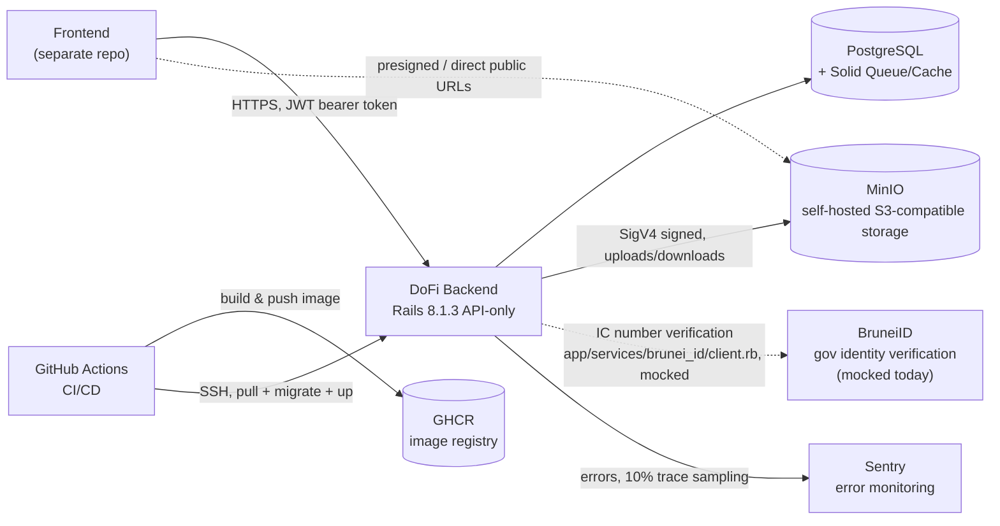
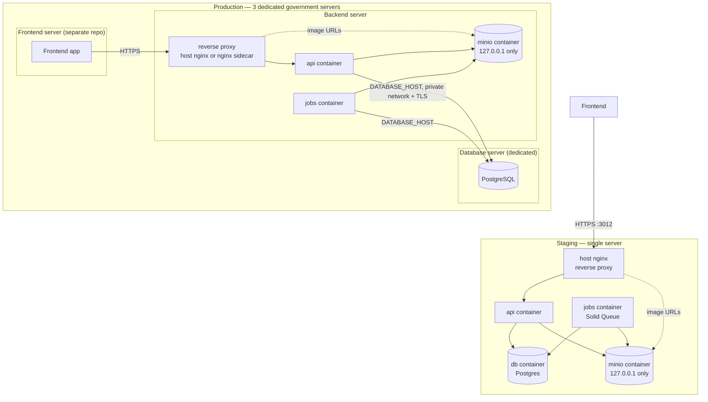
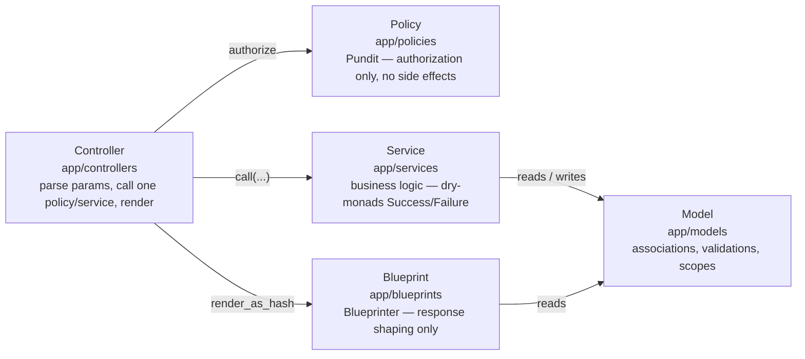
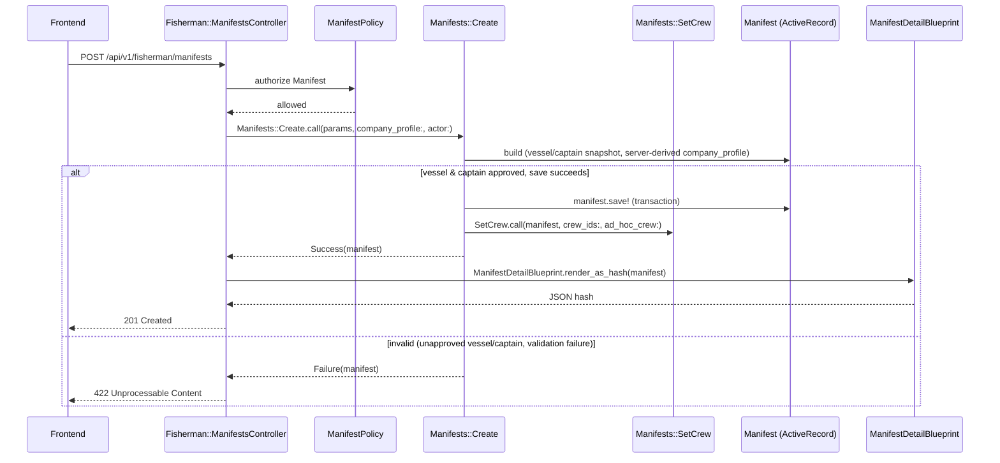
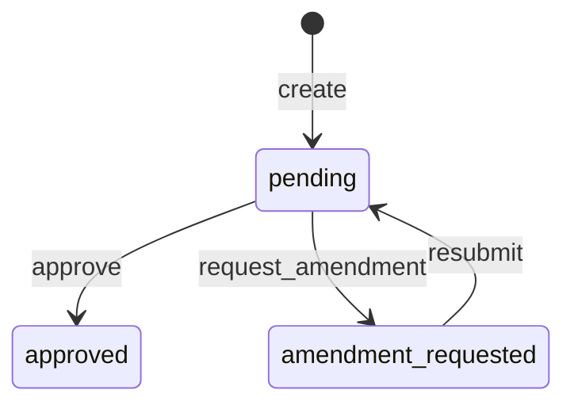
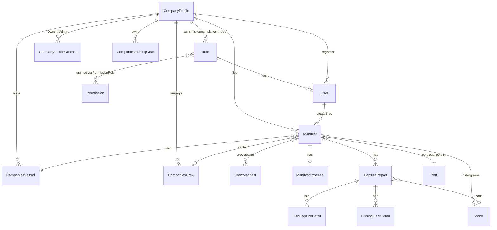

# Architecture Overview

The orientation doc for this repo — how the app is layered, what runs where, and how the core
domain fits together. Each section links to the topic folder that covers it in depth; this doc
stays intentionally at the "one screen" level rather than duplicating those.

## Tech stack at a glance

| Concern | Choice |
|---|---|
| Language / framework | Ruby 3.4.7, Rails 8.1.3 (API-only, no views/assets) |
| Database | PostgreSQL |
| Background jobs / cache | Solid Queue / Solid Cache — DB-backed, no Redis |
| Auth | Devise + devise-jwt (JWT sessions) |
| Authorization | Pundit (one policy per model) |
| Service layer | dry-monads (`Success`/`Failure` results, not exceptions, for expected failure paths) |
| State machine | AASM (e.g. `User#status`, manifest/approval lifecycles) |
| Serialization | Blueprinter |
| Search / pagination | Ransack / Pagy |
| Audit trail / soft delete | Audited / Discard |
| File storage | MinIO (self-hosted, S3-compatible) via Active Storage; Cloudinary kept only until migration completes |
| External identity | BruneiID (government ID verification) via `Faraday`/`jwt` — **mocked today**, see §1 |
| Bilingual fields (EN/MS) | Mobility |
| Monitoring | Sentry (errors) + Lograge (structured JSON request logs) |

## 1. System context

Who the app talks to, and how.

BruneiID is dashed because it's not a real integration yet — `app/services/brunei_id/client.rb`
trusts the frontend-supplied IC number as already verified (the same trust boundary
self-registration already relies on). The `faraday`/`jwt` gems and `BRUNEIID_*` env vars are
reserved for when it becomes real; the swap only touches that one class. See
[`docs/registration/business-flow.md`](registration/business-flow.md) §10 for the full mocked-vs-real
breakdown across the app.

## 2. Deployment topology

Staging is one server; production is three separate government-provided servers. Both are
generalized here — see [`docs/minio/MINIO.md`](minio/MINIO.md) §2 for why MinIO specifically is
loopback-only + reverse-proxied, and [`docs/ci-cd/CI-CD-SETUP.md`](ci-cd/CI-CD-SETUP.md) for the
full CI/CD pipeline.

Key differences from staging: production's `docker-compose.production.yml` has **no `db:`
service** at all (the database server is entirely outside this repo's compose files), and its
`deploy` job is gated behind a GitHub `production` Environment requiring human approval —
staging deploys on every push to `develop`, production only on `main` plus a reviewer sign-off.

## 3. Layered application architecture

Every request flows through the same five layers, each with exactly one job
(enforced in [`CLAUDE.md`](../CLAUDE.md)):

### A concrete request, end to end

`POST /api/v1/fisherman/manifests` — a fisherman filing a new manifest:

Source: [`app/controllers/api/v1/fisherman/manifests_controller.rb`](../app/controllers/api/v1/fisherman/manifests_controller.rb),
[`app/services/manifests/create.rb`](../app/services/manifests/create.rb).

### A recurring pattern: create → approve → resubmit

Four resource families — `CompaniesVessels`, `CompaniesCrews`, `CompaniesFishingGears`, and
`Manifests` — each go through an identical lifecycle, serviced by
near-identical service classes (`create`/`update`/`approve`/`request_amendment`/`resubmit`):

This is the same shape as the Fisherman/Jetty Manager registration approval queue described in
[`docs/registration/business-flow.md`](registration/business-flow.md) §7 — one recurring engine, applied
independently per resource type via each resource's own policy/service pair rather than one shared
conditional (Open/Closed — see `CLAUDE.md`'s SOLID section).

## 4. Domain / entity overview

Simplified — grouped by area, not every column on all ~27 models. `db/schema.rb` is the source of
truth for exact columns; this is for orientation.

**Master/reference data** — `Port`, `Zone`, `FishingGear`, `Nationality`, `Position`, `Dictionary`
(fish-species photos, public bucket — see [`docs/minio/MINIO-WHY-TWO-BUCKETS.md`](minio/MINIO-WHY-TWO-BUCKETS.md)),
and `ApprovalRemark` are lookup tables referenced from many places above (`Manifest.port_out`,
`CaptureReport.zone`, rejection reasons, etc.) rather than owned by any one domain area. All six
share the same CRUD/search shape — see [`docs/api/master-data.md`](api/master-data.md) and
[`docs/api/search-filter-sort-pagination.md`](api/search-filter-sort-pagination.md). Because these
are editable after the fact, `Manifest`/`CrewManifest`/`CompaniesFishingGear` and friends freeze the
fields that matter onto their own rows rather than only holding the foreign key — see
[`docs/data-model/denormalized-snapshots.md`](data-model/denormalized-snapshots.md).

## Where to go deeper

- [`docs/rbac/`](rbac/) — role-based access control: platform/company isolation, authorization vs.
  isolation, permissions model
- [`docs/registration/`](registration/) — actors, roles, registration & approval flow
- [`docs/api/`](api/) — frontend-facing request/response contracts
- [`docs/data-model/`](data-model/) — denormalized historical snapshots vs. live master-data references
- [`docs/minio/`](minio/) — file storage architecture & setup
- [`docs/ci-cd/`](ci-cd/) — CI/CD & deployment
- [`docs/incidents/`](incidents/) — postmortems & dated test reports
- [`CLAUDE.md`](../CLAUDE.md) — the layering/SOLID rules this doc's diagrams illustrate
