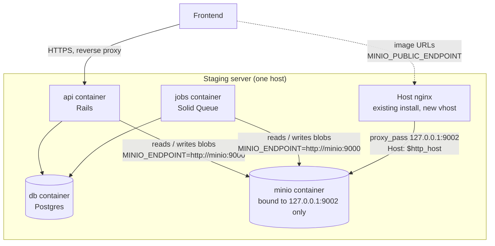
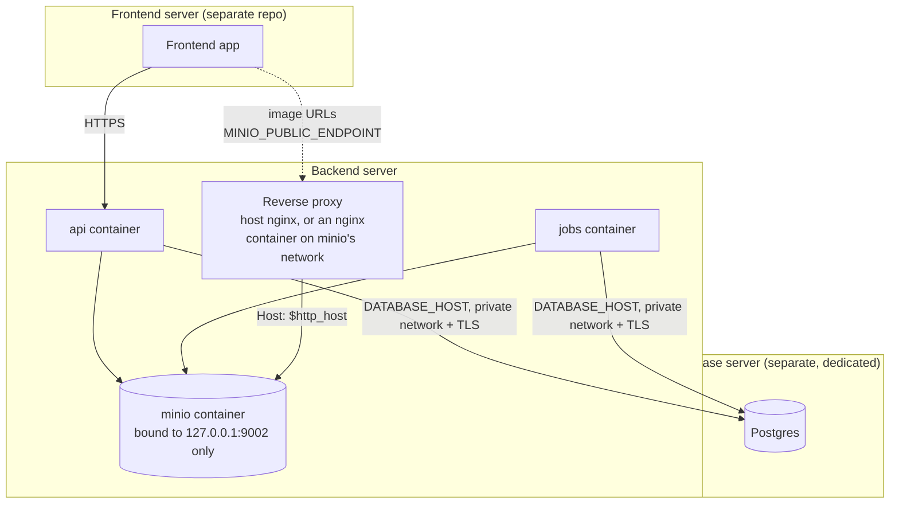
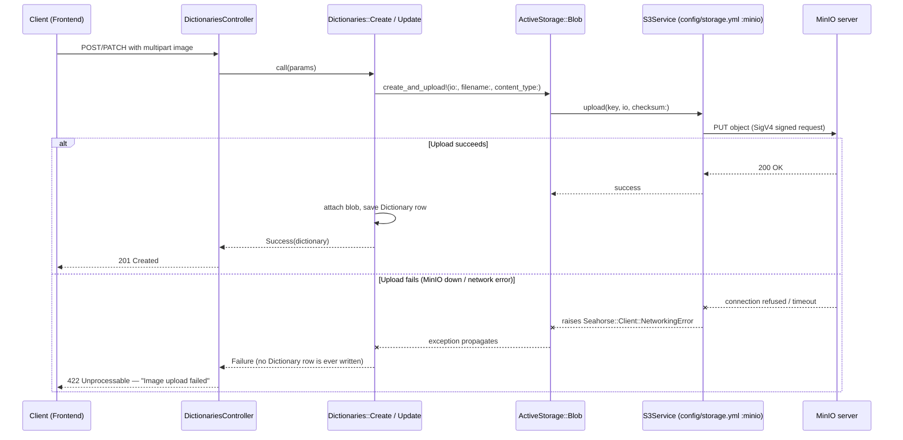
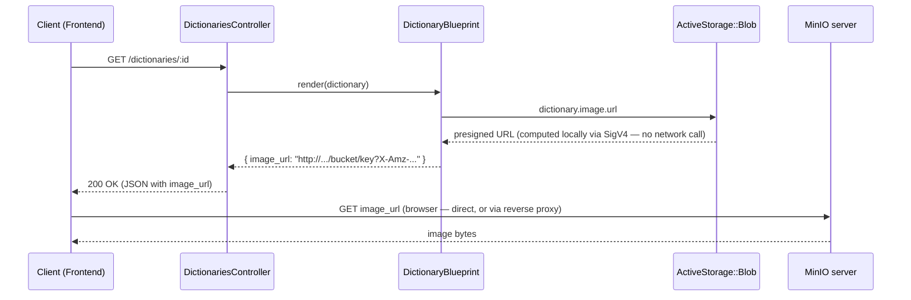
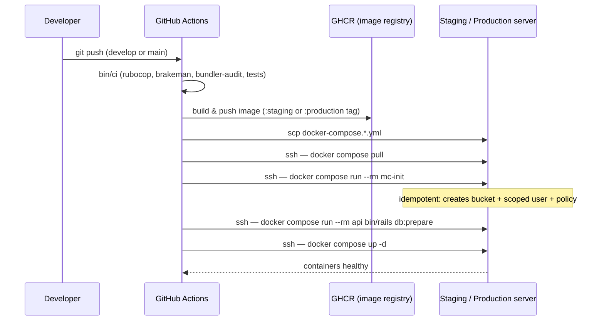

# MinIO — Architecture & Operations Guide

Everything the team needs to understand, use, operate, and troubleshoot MinIO in this repo: what
it is, why we use it, how it fits into the app, how it's deployed in each environment, and how to
start/stop/inspect it.

## 1. What is MinIO

MinIO is a self-hosted, S3-API-compatible object storage server. It stores files (in this app:
`Dictionary` images) as objects in "buckets," addressed the same way Amazon S3 is — so any tool
or library built for S3 (including Rails' own Active Storage) works against it unmodified, just
pointed at a different endpoint.

**Why we use it instead of a cloud SaaS (Cloudinary):** the client (Brunei government) provides
dedicated servers instead of shared cloud hosting, so self-hosting storage removes a third-party
SaaS dependency for their data — a data-sovereignty win, not just a cost one. The MinIO server
itself is free and open-source (AGPLv3). Only its optional web admin *Console* (a GUI) was moved
behind a paid tier in 2025 — irrelevant here, since everything in this repo is driven by the `mc`
CLI and the S3 API, never the Console.

## 2. Architecture

MinIO always runs **on the same server as `api`/`jobs`**, never the database server:
object-store I/O is a worse neighbor for Postgres's WAL than for the CPU/memory-bound app
containers, and the database server stays the most locked-down box (Postgres only) since this is
government infrastructure. MinIO's port is bound to the host's **loopback only**
(`127.0.0.1:9002:9000` in the compose files) — never `0.0.0.0`, so it's still unreachable from the
public internet directly. `api`/`jobs` reach it over the internal Docker network (`minio:9000`);
a reverse proxy running on that same host reaches it via `127.0.0.1:9002` and is the only thing
that makes it reachable from outside the box at all.

**Which reverse proxy?** Whatever already terminates traffic for that server. On the ST Advisory
staging box this is the host's existing nginx install (the same one fronting other apps'
domains — see `/etc/nginx/sites-available/`), with a new vhost added for MinIO (see the tutorial:
`docs/MINIO-PUBLIC-PROXY-SETUP.md`). A government production server without an existing nginx
could instead run a small nginx **container** on the same Docker network as `minio`, proxying to
`minio:9000` directly by Docker DNS name instead of the loopback port — either shape works, as long
as the two rules below hold.

**Two different endpoints, two different jobs.** `config/storage.yml` defines both:
- `minio:` (`MINIO_ENDPOINT`, e.g. `http://minio:9000`) — the internal Docker address. Used for
  every actual upload/download the app performs. Never reachable by a browser.
- `minio_public:` (`MINIO_PUBLIC_ENDPOINT`) — the reverse proxy's public address, used **only** to
  sign the presigned URLs handed to clients (see `DictionaryBlueprint.public_url_for` and §4
  below). Presigning is a local SigV4 computation, not a network call (see §3's retrieval flow),
  so this endpoint only needs to be reachable by the *browser* — the app itself never connects to
  it. If `MINIO_PUBLIC_ENDPOINT` is unset, it falls back to `MINIO_ENDPOINT`, which is why this
  silently "worked" before: the URL was locally valid, just unreachable from outside Docker.
- The proxy must forward `Host` via **`$http_host`, not `$host`** (nginx's names — the same idea
  applies to any proxy). nginx's `$host` silently strips the port, and MinIO's SigV4 verification
  checks the request's actual `Host` header byte-for-byte against what was signed
  (`X-Amz-SignedHeaders=host` in the query string, host *and* port). Getting this wrong doesn't
  error at proxy-config time — every request just 403s with `SignatureDoesNotMatch`, including
  requests using a URL that *was* signed for the right host. **This is the default other vhosts on
  this server already use** (`proxy_set_header Host $host;` in `api.idssurvey.com`, for example) —
  copying that pattern for MinIO reproduces the bug. Confirmed by hand: signing a URL for the
  proxy's address and fetching it through a proxy using `$host` still 403s, because the Host MinIO
  actually receives (port-stripped) doesn't match the signature; switching to `$http_host` fixes
  it immediately. See `docs/MINIO-PUBLIC-PROXY-SETUP.md` and the postmortem in
  `docs/POSTMORTEM-2026-07-27-minio-presigned-url.md` for the full incident this was found in.

### Staging (single server)



### Production (3 dedicated government servers)



### Where each environment stands today

| Environment | Compose file | Active Storage service | MinIO running? |
|---|---|---|---|
| Local dev | `docker-compose.yml` | `:local` (Disk, `config/environments/development.rb`) | No — not needed for day-to-day work |
| Test suite | (in-process) | `:test` (Disk, `config/environments/test.rb`) | No |
| Local test of the prod image | `docker-compose.production.local.yml` | `:minio` | Yes — co-located with `db`/`api`/`jobs`, for testing only |
| Staging | `docker-compose.staging.yml` | `:minio` | Yes — co-located with `db`/`api`/`jobs` |
| Production | `docker-compose.production.yml` | `:minio` | Yes — backend server only; `db` is a separate dedicated server, not in this file |

## 3. How it's used in the app (Active Storage)

We don't call MinIO's S3 API directly anywhere in application code — Rails' **Active Storage**
sits in between, and MinIO is just the storage backend it's configured to use. This is the same
abstraction that used to point at Cloudinary.

- `config/storage.yml` defines the `minio:` service block (`service: S3`, pointed at MinIO via
  `endpoint`/`force_path_style: true`, with credentials from `ENV`).
- `config/environments/production.rb` sets `config.active_storage.service = :minio` — this is the
  one line that makes MinIO the active backend (staging and production both run with
  `RAILS_ENV=production`).
- `app/models/dictionary.rb` declares `has_one_attached :image` — the only model using file
  storage today.
- Application code (`app/services/dictionaries/create.rb`, `update.rb`) and serialization
  (`app/blueprints/dictionary_blueprint.rb`) work against Active Storage's generic API
  (`ActiveStorage::Blob`, `.attach`, `.url`) — none of it is MinIO-specific. Swapping storage
  backends again in the future (e.g. to real AWS S3) would only touch `config/storage.yml` and
  `config/environments/*.rb`.

### Upload flow



The upload happens **eagerly, before any database write** (`ActiveStorage::Blob.create_and_upload!`
in `build_all`/`call`, not the framework's default `after_commit` upload). This is deliberate: an
earlier version of this code let Active Storage do the default thing (upload after the DB row
already committed), which meant a storage failure left an orphaned, image-less `Dictionary` row
in the database while the API reported the whole request failed. Uploading first means a storage
failure never touches the database at all — see the commit history around
`app/services/dictionaries/create.rb` if the "why" here ever needs re-deriving.

### Retrieval flow



Note `.url` never makes a network call — it's a locally-computed, time-limited signed URL. The
byte transfer only happens once the client's browser actually requests that URL.

## 4. How to implement this for a new model

To add file storage to another model, following the existing pattern:

1. `has_one_attached :your_field` (or `has_many_attached`) on the model — same as
   `app/models/dictionary.rb`.
2. Add any content-type/size validation you need (see `Dictionary::ALLOWED_IMAGE_TYPES`,
   `MAX_IMAGE_SIZE` for the pattern).
3. In whatever service creates/updates the record, **upload eagerly** rather than relying on
   Active Storage's default deferred upload — copy the `uploaded_blob_for` private method from
   `app/services/dictionaries/create.rb` or `update.rb`:
   ```ruby
   def uploaded_blob_for(file)
     io = file.respond_to?(:open) ? file.open : file
     ActiveStorage::Blob.create_and_upload!(io: io, filename: file.original_filename,
                                             content_type: file.content_type)
   end
   ```
   Then `record.your_field.attach(uploaded_blob_for(file))` instead of
   `record.your_field.attach(file)`. This preserves the "storage failure never partially commits
   the record" guarantee described above.
4. Add `ActiveStorage::IntegrityError, Aws::Errors::ServiceError, Seahorse::Client::NetworkingError`
   to whatever rescues the failure path (see `app/controllers/application_controller.rb`'s
   `rescue_from` for the global fallback).
5. In a Blueprint, expose the URL the same way `dictionary_blueprint.rb` does — guard
   `.attached?` first, and rescue `ActiveStorage::Error, Aws::Errors::ServiceError` around the URL
   call. **Don't call `.url` directly** — it signs against the blob's own `service_name`
   (`minio`), the internal-only endpoint. Copy `DictionaryBlueprint.public_url_for`, which signs
   against `minio_public` instead so the URL is actually reachable by a browser (see §2):
   ```ruby
   def self.public_url_for(blob)
     service = blob.service_name == "minio" ? ActiveStorage::Blob.services.fetch(:minio_public) : blob.service
     service.url(blob.key, expires_in: 5.minutes, disposition: "inline", filename: blob.filename,
                            content_type: blob.content_type)
   end
   ```

No new bucket is needed for a second model — they'd share the same `MINIO_BUCKET` per
environment unless there's a reason to isolate them (e.g. different retention/access policy).

## 5. Environment variables

All documented in `.env.example`; real values go in each server's own `.env` (never committed).

| Variable | Used by | Notes |
|---|---|---|
| `MINIO_ROOT_USER` / `MINIO_ROOT_PASSWORD` | The `minio` container itself | Admin credentials. Never reused as the app's own credentials. |
| `MINIO_ENDPOINT` | Rails (`config/storage.yml`'s `minio:`) | Internal Docker network address, e.g. `http://minio:9000`. Used for real uploads/downloads — never reachable by a browser. |
| `MINIO_PUBLIC_ENDPOINT` | Rails (`config/storage.yml`'s `minio_public:`) | The reverse proxy's public address, e.g. `http://<server-ip>:9010`. Used only to sign presigned URLs — see §2 and `docs/MINIO-PUBLIC-PROXY-SETUP.md`. Falls back to `MINIO_ENDPOINT` if unset. |
| `MINIO_ACCESS_KEY_ID` / `MINIO_SECRET_ACCESS_KEY` | Rails, and `mc-init` | A **scoped** application key, not the root user — see setup below. |
| `MINIO_REGION` | Rails | Arbitrary (MinIO ignores the value), defaults to `us-east-1`. Must be non-blank or the AWS SDK raises `MissingRegionError` at boot. |
| `MINIO_BUCKET` | Rails, and `mc-init` | One bucket per environment, e.g. `dofi-staging` / `dofi-production` (hyphens, not underscores — S3 bucket names must be DNS-compliant). |

## 6. Setup, per environment

### Local (optional — not needed for normal dev)

Day-to-day dev doesn't need MinIO; it uses the `local` Disk service. To exercise the MinIO code
path locally:

- **Option A** — use `docker-compose.production.local.yml`, which already includes
  `db`+`minio`+`mc-init`+`api`+`jobs` and builds `Dockerfile.production` from source:
  ```bash
  docker compose -f docker-compose.production.local.yml up --build -d
  docker compose -f docker-compose.production.local.yml run --rm mc-init
  ```
- **Option B** — spin up a throwaway MinIO container on the dev network and point a Rails runner
  session at it, without touching any config:
  ```bash
  docker run -d --name test-minio --network dofi-backend_default \
    -e MINIO_ROOT_USER=minioadmin -e MINIO_ROOT_PASSWORD=minioadmin123 \
    minio/minio:RELEASE.2025-04-08T15-41-24Z server /data --console-address ":9001"

  docker compose exec \
    -e MINIO_ENDPOINT=http://test-minio:9000 \
    -e MINIO_ACCESS_KEY_ID=minioadmin -e MINIO_SECRET_ACCESS_KEY=minioadmin123 \
    -e MINIO_BUCKET=dofi-dev-smoketest \
    api bin/rails runner 'ActiveStorage::Blob.service = ActiveStorage::Blob.services.fetch(:minio); ...'

  docker stop test-minio && docker rm test-minio   # cleanup — not part of the dev stack
  ```

### Staging and production (bucket/user provisioning is automated)

The `minio` and `mc-init` services are already defined in `docker-compose.staging.yml` and
`docker-compose.production.yml`. `mc-init` provisions the bucket, a scoped application user, and
a `readwrite` policy — idempotently, safe to re-run — and is wired into both CD workflows
(`docker compose run --rm mc-init`, right after `pull` and before `db:prepare`). **There is no
manual `mc` command to run on a normal deploy.**

The only manual, one-time step per server is **generating the credentials** before the first
deploy — `mc-init` provisions whatever it finds in `.env`, it doesn't invent values:

```bash
openssl rand -hex 12    # -> MINIO_ROOT_USER
openssl rand -hex 24    # -> MINIO_ROOT_PASSWORD
openssl rand -hex 10    # -> MINIO_ACCESS_KEY_ID
openssl rand -hex 20    # -> MINIO_SECRET_ACCESS_KEY
```

Set `MINIO_ENDPOINT=http://minio:9000` and a `MINIO_BUCKET` (e.g. `dofi-staging` /
`dofi-production`) in that server's `.env`. Store the generated values in a password manager —
they become live credentials the moment they're deployed.

Also set up a reverse proxy in front of MinIO's loopback port and set
`MINIO_PUBLIC_ENDPOINT=http://<server-ip-or-domain>:<proxy-port>` so presigned image URLs are
reachable from a browser — see §2 and the step-by-step tutorial in
`docs/MINIO-PUBLIC-PROXY-SETUP.md`. If this server sits behind a firewall/security group, open
that proxy port. Without this, `.url` still returns a validly-signed URL, but it points at the
internal `minio:9000` address a browser can't reach — see the troubleshooting table in §9.

Then just push to the branch that deploys that environment (`develop` → staging, `main` →
production). The CD workflow builds the image, then on the server: pulls, runs `mc-init`, runs
`db:prepare`, brings the stack up.

### CI/CD deploy flow



## 7. Day-2 operations

Run these from the deploy directory on the server (staging's file is renamed to
`docker-compose.yml` there — see `docs/CI-CD-SETUP.md` — so no `-f` flag is needed on staging;
production still needs `-f docker-compose.production.yml`).

```bash
# Status / health
docker compose ps                          # is minio "healthy"?
docker compose logs minio --tail=100 -f    # tail MinIO's logs

# Start (brings up minio along with everything else already defined)
docker compose up -d

# Stop MinIO only (api/jobs keep running but lose storage access — uploads/downloads will fail)
docker compose stop minio

# Restart MinIO (e.g. after an image/version bump)
docker compose restart minio

# Stop everything (containers only — data volume is preserved)
docker compose down

# Re-run bucket/user provisioning by hand (idempotent — e.g. after changing .env)
docker compose run --rm mc-init
```

**Destructive — do not run without understanding the consequences:**
```bash
docker compose down -v   # ALSO deletes the named volumes, including dofi_*_minio_data —
                          # this permanently deletes every stored image. Only ever do this
                          # intentionally, e.g. tearing down a throwaway local test.
```

### Reverse proxy operations (host nginx, staging)

The public-facing proxy in front of MinIO is outside Docker entirely — it's a vhost on the host's
existing nginx install, not a compose service. See `docs/MINIO-PUBLIC-PROXY-SETUP.md` for the full
setup; day-2 commands (need `sudo`):

```bash
sudo nginx -t                                          # validate config before reloading
sudo systemctl reload nginx                            # apply changes (no downtime for other vhosts)
sudo tail -f /var/log/nginx/access.log /var/log/nginx/error.log
```

### Inspecting bucket contents

```bash
docker run --rm --network <the compose network, e.g. dofi-backend-staging-net> \
  -e MC_HOST_local="http://<MINIO_ACCESS_KEY_ID>:<MINIO_SECRET_ACCESS_KEY>@minio:9000" \
  minio/mc ls local/<MINIO_BUCKET>
```

### Rotating credentials

Rotating `MINIO_ACCESS_KEY_ID`/`SECRET_ACCESS_KEY` (the app's key, not root): generate new values,
update `.env`, then either re-run `docker compose run --rm mc-init` (it will create the new user
if it doesn't exist yet — it won't remove the old one) or manage it directly with
`mc admin user add` / `mc admin user remove`. Restart `api`/`jobs` afterward so they pick up the
new `.env` values.

## 8. Migrating existing images from Cloudinary

`config/storage.yml` still defines `cloudinary_staging`/`cloudinary_production` alongside
`minio`, and the `cloudinary` gem is still in the `Gemfile` — this is intentional, not leftover
cruft. `config.active_storage.service = :minio` means **all new uploads go to MinIO**, while
existing Cloudinary blobs keep resolving fine: Active Storage looks up each blob's service by the
name stored on the blob itself (`active_storage_blobs.service_name`), not by the app-wide
default, so old and new blobs coexist safely during the migration window.

`lib/tasks/dictionaries.rake` provides an idempotent migration task:

```bash
bin/rails dictionaries:migrate_images_to_minio DRY_RUN=1   # preview what would move
bin/rails dictionaries:migrate_images_to_minio             # actually copy the bytes over
```

It finds every `Dictionary` image blob whose `service_name` isn't `minio`, downloads the bytes
(works regardless of the current backend), re-uploads them to MinIO, and updates the blob's
`service_name`. Safe to re-run — already-migrated blobs are skipped.

**Cutover checklist**, once the task reports zero remaining non-`minio` blobs in every
environment:

1. Remove the `cloudinary_staging`/`cloudinary_production` blocks from `config/storage.yml`.
2. Remove `gem "cloudinary"` from the `Gemfile`, run `bundle install`.
3. Remove `CloudinaryException` from the 4 rescue sites: `app/controllers/application_controller.rb`,
   `app/blueprints/dictionary_blueprint.rb`, `app/services/dictionaries/create.rb`,
   `app/services/dictionaries/update.rb`.
4. Remove `CLOUDINARY_URL` from `.env.example` and each server's real `.env`.

Do this in one change — `rescue_from` resolves `CloudinaryException` at class-load time, so
leaving a reference to it after the gem is gone crashes the app at boot.

## 9. Troubleshooting

| Symptom | Likely cause | Fix |
|---|---|---|
| `Aws::Errors::MissingRegionError` at boot | `MINIO_REGION` blank | Set it (defaults to `us-east-1` via `ENV.fetch` — this usually means the fetch default was removed) |
| Upload succeeds but presigned URL 403s | Bucket policy / access key not scoped to that bucket | Re-run `docker compose run --rm mc-init` (idempotent) and check its output for errors |
| `Seahorse::Client::NetworkingError` on every upload | MinIO container down or unreachable from `api`/`jobs` | `docker compose ps` — confirm `minio` is healthy and on the same network |
| `image_url` in an API response is `http://minio:9000/...` and the browser shows `DNS_PROBE_FINISHED_NXDOMAIN` | `MINIO_PUBLIC_ENDPOINT` is unset (falls back to the internal `MINIO_ENDPOINT`), or no reverse proxy is fronting MinIO's loopback port yet | Set up the proxy (`docs/MINIO-PUBLIC-PROXY-SETUP.md`), set `MINIO_PUBLIC_ENDPOINT` to its public address, restart `api`/`jobs` — see §2 |
| Presigned URL 403s (`SignatureDoesNotMatch`), even for a URL that *was* signed against `MINIO_PUBLIC_ENDPOINT` | The proxy's `Host` header directive strips the port — e.g. nginx's `proxy_set_header Host $host;` (this server's *default* convention for other vhosts, see `api.idssurvey.com`) instead of `$http_host;` | Use `$http_host`, not `$host` — confirmed by hand, `$host` 403s every request through the proxy regardless of which endpoint signed it. See `docs/POSTMORTEM-2026-07-27-minio-presigned-url.md` |
| Everything above is configured correctly but the fix still isn't live | `docker cp`'d code into a running container for a quick test, then the container was recreated (next deploy/`docker compose pull`) | `docker cp` changes are wiped on container recreate — they're not the real fix, only a way to validate one before shipping. Ship the code change through the normal path: commit, push, let CI/CD build a new image |
| Image uploads silently land in the wrong bucket between environments | `.env` on that server has the wrong `MINIO_BUCKET` | Each server's `.env` sets its own bucket name — the same `minio` service block in `config/storage.yml` is shared across environments |
| `force_path_style` errors / bucket-in-hostname URLs | Missing `force_path_style: true` | Already set in `config/storage.yml` — don't remove it, MinIO doesn't support virtual-hosted-style addressing |
| Deploy fails at the `mc-init` step | MinIO container unhealthy, or root credentials in `.env` don't match what the `minio` container was actually started with | Check `docker compose logs minio`; if root credentials changed after the volume already has data, MinIO keeps the *original* credentials — update `.env` back to match, or wipe the volume (destructive) to reset |
| Images disappear after a deploy | Someone ran `docker compose down -v` | The `-v` flag deletes the data volume — see Day-2 operations above. Restore from backup if you have one; MinIO itself has no undo. |

## 10. Security notes

- MinIO's port is never published to a public interface in any compose file — it's bound to
  `127.0.0.1` only, so the sole path in from outside the server is the reverse proxy (host nginx
  on staging today; see `docs/MINIO-PUBLIC-PROXY-SETUP.md`). That proxy is currently plain HTTP
  with no auth beyond MinIO's own SigV4 signature check — anyone who can reach its port can
  attempt requests against MinIO (they'll still need a valid signature to get anything back). Put
  it behind TLS/a firewall allowlist if that's not acceptable for a given server.
- The app only ever uses a **scoped** access key (`MINIO_ACCESS_KEY_ID`/`SECRET_ACCESS_KEY`),
  never the root user (`MINIO_ROOT_USER`/`PASSWORD`) — limits blast radius if the app's
  credentials ever leak.
- Self-hosting means *we* own durability now (Cloudinary previously handled this). There is no
  automatic backup of the MinIO data volume — set up your own backup strategy (e.g. periodic
  `mc mirror` to another location) if the stored images need to survive a lost/corrupted disk.
- Bucket names, region, and endpoint are not secrets; root/access credentials are — keep them
  out of git (already covered by `.gitignore`'s `/.env*` rule) and out of chat/ticket systems
  once generated.
