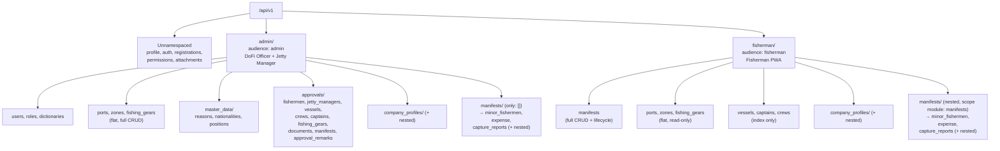

# API Endpoint Structure

A full map of every route in [`config/routes.rb`](../../config/routes.rb) — the source of truth;
this doc mirrors it and should be updated whenever routes.rb changes. For per-resource field
contracts see [`master-data.md`](master-data.md); for list/search/sort/pagination params see
[`search-filter-sort-pagination.md`](search-filter-sort-pagination.md); for locale see
[`locale.md`](locale.md); for the layered request flow (Controller → Policy → Service → Model →
Blueprint) see [`../ARCHITECTURE.md`](../ARCHITECTURE.md) §3.

## Two-layer authorization

Every route under `admin/` or `fisherman/` carries `defaults: { audience: "admin"/"fisherman" }`.
`RequireAudience` (`app/controllers/concerns/require_audience.rb`) is a coarse pre-filter that
rejects a user whose role doesn't belong to that audience before any business logic runs; Pundit
policies (`app/policies`) then do the real per-action/per-record authorization. Both layers run on
every request — audience is not a substitute for Pundit.



---

## Unnamespaced (no audience restriction)

Not under `admin/` or `fisherman/` — either symmetric across both audiences with no Pundit
differentiation, or delegates entirely to whichever record owns the resource.

```
GET    /up                                    # rails/health#show — load balancer / uptime check

POST   /api/v1/auth/sign_in                   # devise_for :users → api/v1/sessions#create
DELETE /api/v1/auth/sign_out                  # api/v1/sessions#destroy
GET    /api/v1/auth/me                        # api/v1/sessions#me

PATCH  /api/v1/profile/locale                 # profiles#locale — current_user only

POST   /api/v1/auth/brunei_id                 # brunei_id_sessions#create — mocked BruneiID login
POST   /api/v1/auth/brunei_id/callback        # brunei_id_sessions#callback — audience-specific BruneiID OIDC callback

POST   /api/v1/registrations/jetty_manager    # registrations/jetty_managers#create
GET    /api/v1/registrations/status           # registrations/status#show

GET    /api/v1/permissions                    # permissions#index — full catalog, any authenticated user

GET    /api/v1/attachments/:signed_id         # attachments#show — 302 to a freshly-signed MinIO URL,
                                               # authorized against whichever record owns the blob
```

---

## `admin/` — DoFi Officer + Jetty Manager

Controllers live under `Api::V1::Admin::*`.

### Reference data — flat (full CRUD)

```
/api/v1/admin/users                index show create update destroy
/api/v1/admin/roles                index show create update destroy
/api/v1/admin/dictionaries         index show create update destroy
/api/v1/admin/ports                index show create update destroy
/api/v1/admin/zones                index show create update destroy
/api/v1/admin/fishing_gears        index show create update destroy
```

Ports/zones/fishing_gears are flat here — **not** under `master_data/` below — because they're
also dual-mounted as flat resources on the fisherman side (see below); reasons/nationalities/
positions have no fisherman-facing equivalent, so they stay grouped under `master_data/` purely as
admin's own internal organization (`config/routes.rb` comment, admin namespace).

> ⚠️ `master-data.md` and `search-filter-sort-pagination.md` currently document Port/Zone/Fishing
> Gear at `/api/v1/admin/master_data/...` — that's stale relative to the routes above. Worth fixing
> those two docs separately; flagging here rather than silently editing them.

### `master_data/` — no fisherman equivalent

```
/api/v1/admin/master_data/reasons        index show create update destroy
/api/v1/admin/master_data/nationalities  index show create update destroy
/api/v1/admin/master_data/positions      index show create update destroy
```

### `approvals/` — review queues (`Api::V1::Admin::Approvals::*`)

```
/api/v1/admin/approvals/fishermen              index show
  POST   .../:id/approve
  POST   .../:id/reject
  POST   .../:id/deactivate
  POST   .../:id/reactivate
  POST   .../:id/revoke

/api/v1/admin/approvals/jetty_managers         index show
  POST   .../:id/approve
  POST   .../:id/reject
  POST   .../:id/deactivate
  POST   .../:id/reactivate
  POST   .../:id/revoke

/api/v1/admin/approvals/approval_remarks       index show create update destroy

/api/v1/admin/approvals/vessels                index show
  POST   .../:id/approve
  POST   .../:id/request_amendment

/api/v1/admin/approvals/crews                  index show
  POST   .../:id/approve
  POST   .../:id/request_amendment

/api/v1/admin/approvals/captains               index show
  POST   .../:id/approve
  POST   .../:id/request_amendment

/api/v1/admin/approvals/fishing_gears          index show
  POST   .../:id/approve
  POST   .../:id/request_amendment

/api/v1/admin/approvals/documents              index show
  POST   .../:id/approve
  POST   .../:id/request_amendment

/api/v1/admin/approvals/manifests              index show update
  GET    .../tab_counts
  POST   .../:id/approve_port_out
  POST   .../:id/request_amendment_port_out
  POST   .../:id/approve_port_in
  POST   .../:id/request_amendment_port_in
```

`Api::V1::Admin::ManifestsController` (bare, `only: []`) subclasses
`Api::V1::Admin::Approvals::ManifestsController` — it exists purely as the parent for the nested
`manifests/` routes below, not to expose any action of its own.

### `company_profiles/` — dual-mounted with fisherman

Same controllers as the fisherman side (`controller: "/api/v1/company_profiles"` etc.); each
resource's own `Policy::Scope` decides what's visible per audience, not the route.

```
/api/v1/admin/company_profiles                       index show create update destroy
/api/v1/admin/company_profiles/:id/contacts           create update destroy
/api/v1/admin/company_profiles/:id/vessels            index show create update destroy
  POST   .../:vessel_id/images
  /api/v1/admin/company_profiles/:id/vessels/:vessel_id/fishing_gears   full CRUD
/api/v1/admin/company_profiles/:id/crews              index show create update destroy
/api/v1/admin/company_profiles/:id/captains           index show create update destroy
/api/v1/admin/company_profiles/:id/documents          index create update
```

### `manifests/` sub-resources — officer review only (read/verify, no create/edit)

Admin only reviews these (index/show + officer-only capture-report verify workflow); fisherman
owns creating/editing them (see `fisherman/manifests/` below). Both sides share read-only logic via
`Manifests::*` concerns in `app/controllers/concerns/manifests/`.

```
/api/v1/admin/manifests/:manifest_id/minor_fishermen              index
/api/v1/admin/manifests/:manifest_id/expense                      show
/api/v1/admin/manifests/:manifest_id/capture_reports               index show
  POST   .../:id/verify
  POST   .../:id/request_amendment
  /api/v1/admin/manifests/:manifest_id/capture_reports/:id/fish_capture_details     index show
  /api/v1/admin/manifests/:manifest_id/capture_reports/:id/fishing_gear_details     index show
```

---

## `fisherman/` — Fisherman PWA

Controllers live under `Api::V1::Fisherman::*`.

### `manifests` — full lifecycle

```
/api/v1/fisherman/manifests            index show create update destroy
  GET    .../tab_counts
  POST   .../:id/submit_port_out
  POST   .../:id/resubmit_port_out
  POST   .../:id/submit_port_in
  POST   .../:id/resubmit_port_in
  POST   .../:id/skip_capture_report
  GET    .../:id/offline_bundle
```

### `manifests/` sub-resources — fisherman owns create/update/resubmit

```
/api/v1/fisherman/manifests/:manifest_id/minor_fishermen           index create destroy
/api/v1/fisherman/manifests/:manifest_id/expense                   show create update
/api/v1/fisherman/manifests/:manifest_id/capture_reports            index show create update
  POST   .../:id/resubmit
  /api/v1/fisherman/manifests/:manifest_id/capture_reports/:id/fish_capture_details    index show create update destroy
    POST   .../bulk_sync
  /api/v1/fisherman/manifests/:manifest_id/capture_reports/:id/fishing_gear_details    index show create update destroy
```

### Reference data — flat, read-only

```
/api/v1/fisherman/ports            index show
/api/v1/fisherman/zones            index show
/api/v1/fisherman/fishing_gears    index show
/api/v1/fisherman/vessels          index
/api/v1/fisherman/captains         index
/api/v1/fisherman/crews            index
```

### `company_profiles/` — dual-mounted with admin

Identical shape to the admin side above (same controllers, `Policy::Scope`-gated):

```
/api/v1/fisherman/company_profiles                     index show create update destroy
/api/v1/fisherman/company_profiles/:id/contacts        create update destroy
/api/v1/fisherman/company_profiles/:id/vessels         index show create update destroy
  POST   .../:vessel_id/images
  /api/v1/fisherman/company_profiles/:id/vessels/:vessel_id/fishing_gears   full CRUD
/api/v1/fisherman/company_profiles/:id/crews           index show create update destroy
/api/v1/fisherman/company_profiles/:id/captains        index show create update destroy
/api/v1/fisherman/company_profiles/:id/documents       index create update
```

---

## Controller module conventions

- `namespace :admin/:fisherman` → controller class under `Api::V1::Admin::*` / `Api::V1::Fisherman::*`.
- `scope module: "manifests"` (not bare nested `resources`) is required to route into the
  `Admin::Manifests::*` / `Fisherman::Manifests::*` controller modules — nested `resources` blocks
  alone only affect the URL/params, not the controller's module path.
- Rails' `resource :expense` (singular) still maps to the pluralized `ExpensesController`, per
  standard Rails convention — e.g. `app/controllers/api/v1/admin/manifests/expenses_controller.rb`.
- `company_profiles` and its nested resources are dual-mounted under both namespaces pointing at
  the *same* controllers (`controller: "/api/v1/company_profiles"`, an absolute path outside
  `admin`/`fisherman`) rather than duplicated — each resource's Pundit `Policy::Scope` is what
  actually differs per audience.
