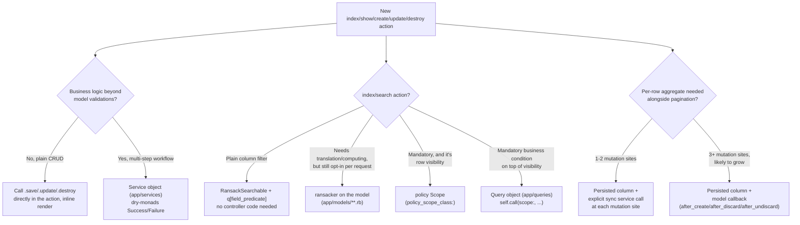

# Thin Controllers & Query Objects

The canonical shape for controller actions, when (and when not) to write a Query object or a
service, and how to keep a persisted aggregate in sync. This is the worked example behind
[`CLAUDE.md`](../../CLAUDE.md)'s "Mandatory controller/query shape contract" — read that section
first; this doc is the rationale and the fuller reference, not a duplicate of it.

## 1. Why this doc exists

An audit of the ten controllers under `app/controllers/api/v1/admin/` found four real deviations from
the pattern the rest of the codebase already follows:

- A raw SQL heredoc embedded directly in a controller to compute a correlated `COUNT(*)`.
- The same comma-separated multi-value param-parsing idiom reimplemented from scratch in three
  different controllers, each with slightly different variable names.
- Two sibling controllers (same shape: simple single/two-field CRUD) each inventing their own,
  mutually incompatible, bespoke CRUD-response indirection (`persist`/`render_resource` in one,
  `render_collection`/`create_resource`/`update_resource`/`destroy_resource` in the other) instead of
  the flat inline-render style every other controller already uses.

None of this was caught by Rubocop or the test suite — it's a consistency problem, not a correctness
one, and consistency problems only get worse over time without something to point at. This doc is
that something.

## 2. Decision tree

## 3. Controller action shape

Every action is: `authorize` → one call → inline `render`. No private `render_resource`/
`create_resource`/`persist` helper, no shared "render this resource" method invented for one
controller. See [`app/controllers/api/v1/admin/dictionaries_controller.rb`](../../app/controllers/api/v1/admin/dictionaries_controller.rb) —
`index`/`show`/`create`/`update`/`destroy` each render inline, including a plain
`if @dictionary.destroy ... else ... end` for the one action with no service behind it.

This looks repetitive across actions and across sibling controllers (`dictionary_families_controller.rb`
and `dictionary_groups_controller.rb` render almost-identical JSON shapes). That repetition is
intentional — three similar `render json:` blocks are more legible and more greppable than an
indirection layer invented to save them, and per-controller helper methods are exactly what caused the
two sibling controllers above to drift into incompatible shapes in the first place.

## 4. Ransack first — including for computed/translated fields — Query object only for what's left

Every controller with a searchable `index` already includes `RansackSearchable`
(`app/controllers/concerns/ransack_searchable.rb`) and calls `apply_ransack_search(scope,
default_sort:)`. If the field you need to filter on is already (or can be) listed in the model's
`ransackable_attributes`, that's the filter — `q[field_in][]=...`/`q[field_eq]=...` — with zero
controller code. See [`docs/api/search-filter-sort-pagination.md`](../api/search-filter-sort-pagination.md)
for the full frontend contract.

**Before reaching for a Query object, check whether a Ransack `ransacker` covers it.** A `ransacker`
declares a computed/virtual filterable field backed by an arbitrary SQL expression, whitelisted in
`ransackable_attributes` exactly like a real column — the standard tool for "the public filter value
needs translating before it hits the database" (an earlier version of this doc used a hand-rolled
`Admin::AccountsQuery` for exactly this, before realizing `ransacker` already solved it).

But first check whether the endpoint's shape makes the translation unnecessary. External Users used to
be one `/admin/accounts` list for two account types whose status lives in different columns
(`users.status` vs `users.fisherman_status`), so it needed an `account_status` ransacker to present one
"active"/"inactive" vocabulary. Once it split into one endpoint per tab, each tab filters its own column
directly (`q[status_eq]`, `q[fisherman_status_eq]`) and the ransacker was deleted. Likewise, IC search
that ignores the dash needs no ransacker: `q[ic_number_or_normalized_ic_number_cont]` combines two
existing columns with Ransack's `_or_`.

If you do write a ransacker, keep it **self-contained**: it must not reference a table the endpoint
happens to JOIN (e.g. `roles`). `ransackable_attributes` exposes it on every endpoint for that model, and
on a relation without that JOIN the query fails with "missing FROM-clause entry" (a 500) instead of just
filtering — which is exactly what the old `account_status` did on `admin/users`.

Reach for an actual Query object only when the thing you need **isn't optional per-request**. A
`ransacker` is still something the client opts into via `q[...]`, so it can't express a scope that must
always apply regardless of what the client sends. `EntityUsers::IndividualFishermenQuery`
(`app/queries/entity_users/individual_fishermen_query.rb`) is the example: it always constrains the
Entity Users visibility scope to individual registration types, a business condition *on top of* what
the policy lets the officer see.

Not every mandatory narrowing is a Query object, though. If the condition is part of what a policy
scope already computes, expose it as its own Scope instead. The External Users screen has one tab per
endpoint (`admin/external_users/{jetty_managers,fishermen}`), and which tab a row shows up on is row
visibility, so `ExternalUserPolicy` has one scope per tab (`JettyManagerScope`/`FishermanScope`), each
selected with `policy_scope_class:`. An earlier version built the union of both halves in one policy
scope and then re-split it with `ExternalUsers::*Query` objects. That wrote every tab condition twice.

Query object convention (when you do need one): `self.call(scope:, ...)` with keyword arguments,
`private_class_method` for internal steps, returns an ActiveRecord relation (or a plain Hash when the
caller needs a finished aggregate, not a further-composable relation — see
`app/queries/fisherman/dashboard/summary_query.rb` for that shape). No authorization, no response
formatting, no side effects. Prefer Rails' own relation combinators (`#or`, `#merge`) over a raw SQL
string with positional `?` binds when the same result is reachable with plain `.where` hashes.

## 5. Persisted aggregates: model callback vs explicit service call

Two real examples in this codebase, deliberately different:

- **`app/services/company_profiles/sync_worker_quota.rb`** — recomputes `company_profile.worker_quota`
  by summing `companies_vessels.max_crew`, called explicitly from
  `app/services/companies_vessels/create.rb`, `update.rb`, and inline from the discard action in
  `vessels_controller.rb`. Three call sites, all in the same narrow feature area — small enough that a
  human can be trusted not to add a fourth vessel-mutation path without remembering the sync call.
- **`app/models/concerns/user/entity_user_counting.rb`** — maintains
  `company_profile.entity_user_count` via `after_create`/`after_discard`/`after_undiscard` callbacks
  on `User`. Users that affect this count are created or discarded from at least six different places
  across the codebase (three registration/provisioning services, three discard call sites across admin
  and fisherman controllers), with more likely to be added as registration flows grow. Threading an
  explicit sync call through six-plus scattered sites risks silent drift the moment one new path
  forgets it — worse than the live correlated subquery this replaced. The callback can't be forgotten
  because it isn't called from the mutation site at all; it fires automatically whenever `User`'s
  kept-state changes, using `Discard::Model`'s own `after_discard`/`after_undiscard` hooks (already a
  dependency, already included on `User`).

Rule of thumb: **one or two mutation sites in one feature area → explicit service call.** **Three or
more, or spread across features/audiences → model callback.** Either way, the aggregate itself is a
persisted column, backfilled once via a migration — not a live correlated subquery once the row is
mutated from more than a couple of places.

## 6. Extending this doc

When a new deviation from this shape gets fixed, add it here rather than only fixing the code —
the value of this doc is that it stays the accurate, current answer to "how do we do X here," not a
one-time cleanup log.
