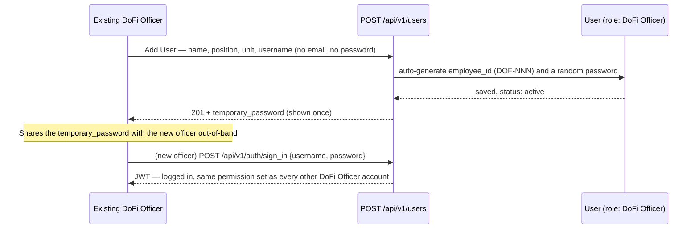
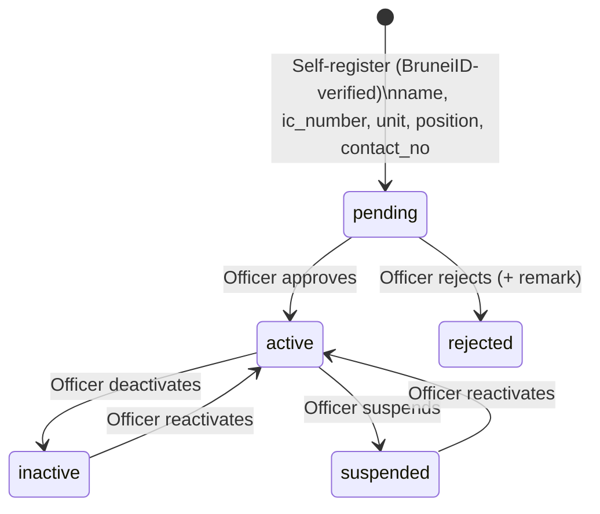
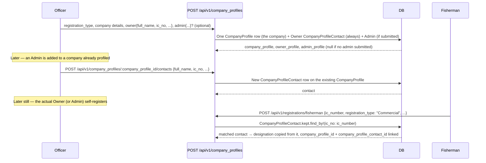

# Business Flow — Actors, Roles & Lifecycles

This is the business-level companion to [`registration-flow.md`](registration-flow.md) (endpoint
request/response contracts) and [`testing-mock-brunei-id-login.md`](testing-mock-brunei-id-login.md)
(how to exercise it). This doc answers a different question: **who are the actors, how does each one
get an account, who approves what, and why were the non-obvious decisions made this way.**

---

## 1. The three actors

| Actor | Role (`kind`) | How they get an account | How they log in |
|---|---|---|---|
| **DoFi Officer / Administrator** | `"DoFi Officer"` | Created by another officer via **User Management → Add User** (internal, authenticated) | `username` + password (real credential check) |
| **Jetty Manager** | `"Jetty Manager"` | Self-registers via the public registration form (BruneiID-verified) | BruneiID QR re-scan (mocked today) |
| **Fisherman** | `"Fisherman"` | Self-registers via the public registration form (BruneiID-verified), one of 3 sub-types | BruneiID QR re-scan (mocked today) |

**The one thing that explains most of this system's design**: officers are an *internal, trusted*
population managed by other officers, so they get a real credential (`username`/password) chosen by
the system, no external identity check. Jetty Managers and Fishermen are an *external, self-service*
population whose identity is established once, externally, by BruneiID at registration time — so
they never set a password at all, and "logging in" later is just re-proving the same BruneiID
identity, not a fresh credential check. Every other decision below (no email requirement, no manual
passwords, why User Management needed its own password story) follows from this split.

---

## 2. Roles & Permissions model

```
Role (e.g. "DoFi Officer") ──has many──> Permission (e.g. "dofi_officer_users.create")
```

- One `User` belongs to exactly one `Role` (single-role model — no multi-role assignment).
- A `Permission` is identified by a `code` string, conventionally `"<resource>.<action>"`
  (`dofi_officer_users.create`, `fisherman_approvals.approve`, `positions.list`, ...).
- Every controller action calls `user.permission?(*codes)` (via a Pundit policy) — true if the
  user's role has *any* of the listed permission codes.
- **"Administrator" is not a separate role.** All DoFi Officer/Administrator accounts share the
  same DoFi Officer role and the same permission set (today: full access). "Administrator" vs.
  "DoFi Officer" is a **Position** (a master-data job title, see §9) purely for display — it does
  not change what the account can do. If a genuinely lower-privilege internal role is ever needed
  (e.g. a read-only officer), that's a *new* `Role` row with its own permission set, not a
  conditional on the existing one (Open/Closed — see CLAUDE.md).
- `Role`/`Permission`/`Users::Create` intentionally have no concept of "this role needs X field" —
  that logic lives on `User` itself (`officer?`/`jetty_manager?`/`fisherman?` predicates gate
  presence validations). Roles are just a name + a permission set; they don't carry business rules.
- The three fixed system roles are identified by `Role#kind` (`Role::DOFI_OFFICER`/`JETTY_MANAGER`/
  `FISHERMAN`), a nullable string column — nullable so a custom role created via the Roles API isn't
  forced into one of these three buckets. **`kind` is never accepted by `RolesController#role_params`**
  — it can only be set via `db/seeds/roles.rb` or the console. `User#officer?/jetty_manager?/
  fisherman?`, the approval policies' scopes, and which role `Users::RegisterJettyManager`/
  `RegisterFisherman` assign all key off `kind` — see §9 for why this is a dedicated column rather
  than reusing a display code.
- `Role::EXTERNAL_KINDS` (Jetty Manager, Fisherman) marks the two roles that only ever come from
  self-registration. `Users::Create` (the admin "Add User" endpoint) rejects any `role_id` whose role
  is `external?` — the admin portal can create DoFi Officers and any future custom (non-external)
  internal role, but never a Jetty Manager/Fisherman account. This makes "created via admin portal" a
  real guarantee rather than convention, and also means a user created this way can never disappear
  from `UserPolicy::Scope`'s index (which excludes the same `EXTERNAL_KINDS`).

---

## 3. DoFi Officer / Administrator lifecycle



No approval step — an officer creating another officer account is itself the trust boundary (gated
by the `dofi_officer_users.create` permission), unlike the external actors below whose *registration*
is unauthenticated and therefore always lands `pending`.

**Why no email/password fields in Add User**: mirrored from how Fisherman/Jetty Manager already
never set their own password (see §1). Since there's no mailer configured in this app, "email them a
temporary password" isn't realistically available yet, so the temporary password is returned once in
the API response for the creating officer to relay directly. `email` stays on the `User` model as an
optional legacy/contact field — never required, for any role, since login for every actor type is now
keyed on something other than email (`username` for officers, `ic_number`/BruneiID for external
actors).

---

## 4. Jetty Manager lifecycle



Registration is public (no `Authorization` header) — BruneiID verification happens on the frontend
before the register form is even shown; the backend receives the *result* of that verification
(`brunei_id_verified_at` gets set unconditionally at registration time), not a token to re-verify
itself. A cryptographically random password is generated and never surfaced — it exists only because
Devise's `:database_authenticatable` needs *some* value in `encrypted_password`; nobody ever needs to
know it, since login is BruneiID re-scan, not this password.

---

## 5. Fisherman lifecycle

Same `pending → active/rejected` shape as Jetty Manager, but registration branches on
`registration_type`:

| Registration Type | Needs a matching `CompanyProfile`? | `designation` |
|---|---|---|
| `"Commercial"` | Yes — IC must match a pre-profiled company (§6) | Server-derived from the matched profile |
| `"Small-Scale (Company)"` | Yes — same as above | Server-derived from the matched profile |
| `"Small - Scale (Full-Time)"` | No | Whatever the client submits (no company relationship) |

**Why `designation` is server-derived, not client-submitted, for company-affiliated fishermen**: the
officer already recorded, during Profiling (§6), which specific person is the Owner and which is the
Admin of a given company. If the registering fisherman could just *claim* "Owner" on the register
form, that claim would never be checked against what the officer actually profiled. Matching by
`ic_number` against the pre-created `CompanyProfile` row and copying *that* row's `designation` closes
this gap — the registrant can't self-declare a designation for a company they're affiliated with.

---

## 6. Officer Profiling — the prerequisite step for company-affiliated fishermen

Before a Commercial or Small-Scale (Company) fisherman can self-register, an officer must have
already profiled their company:



`CompanyProfile` is one row per **company**; `CompanyProfileContact` is one row per **person**
(`belongs_to :company_profile`, `designation` "Owner" or "Admin"). Company-level fields
(company_name, address, ROCBN No., worker_quota, ...) live once, on the company row — editing them
via `PATCH /api/v1/company_profiles/:id` can never desync an Owner/Admin pairing, because there's no
pairing to maintain, just a normal `has_many :contacts`. "Delete the company"
(`DELETE /api/v1/company_profiles/:id`) discards the company **and** all its kept contacts in one
transaction (`CompanyProfiles::Destroy`); removing a single contact without touching the company is
`DELETE /api/v1/company_profiles/:company_profile_id/contacts/:id`.

The list endpoint (`GET /api/v1/company_profiles`, searchable by company name/ROCBN No.) exists
specifically so the FE's "Select & Search Company" flow can find an existing company when profiling a
second person — that's now the real `POST .../contacts` call above, not a resubmission through
`create` (which previously duplicated the Owner every time). `index` and `show` both render one entry
per company, with `owner_profile`/`admin_profile` nested from `CompanyProfile#owner_contact`/
`#admin_contact`.

**Migration note**: this replaced an earlier design where `CompanyProfile` held both company- and
person-level fields directly (one row per person, Owner+Admin linked only by matching `rocbn_no` +
`company_name` text). That design allowed the pairing to silently desync on edit and had no real way
to add a person to an existing company without duplicating the Owner — see the `BackfillCompanyProfileContacts`
migration for how existing data was reconciled.

---

## 7. FINS Approval — the shared approve/reject engine

One workflow, two queues (Fisherman, Jetty Manager) — same shape for both:

- **List/Show**: officer sees `pending`-and-beyond registrations for that actor type
  (`fisherman_approvals.list/.view` or `jetty_manager_approvals.list/.view`).
- **Approve** (`*_approvals.approve`): `pending → active`. No reason needed.
- **Reject** (`*_approvals.approve` — same permission code, rejecting is still "acting on an
  approval queue"): `pending → rejected`, requires an `approval_remark_id` from the **Approval
  Remarks** master-data list (`"Incomplete account information"`, `"Information mismatch"`, ...) —
  copied onto the user's `rejection_reason` so the FE can show *why* without a free-text field the
  officer has to type every time.
- Both queues run through the same `AASM` state machine on `User` (§4's diagram) — `approve!`/
  `reject!` are the same two events regardless of which actor type is being reviewed; only the
  *scope* (which role's users show up in which queue) differs, via `FishermanApprovalPolicy::Scope`
  / `JettyManagerApprovalPolicy::Scope`.

---

## 8. Login: two genuinely different mechanisms

| | DoFi Officer / Administrator | Jetty Manager / Fisherman |
|---|---|---|
| Endpoint | `POST /api/v1/auth/sign_in` | `POST /api/v1/auth/brunei_id` |
| Credential | `username` + real password | `ic_number` only (BruneiID-verified externally) |
| Gates on status? | No (Devise handles active-session concerns separately) | Yes — only `active` gets a token; `pending`/`rejected` get the same status payload as the registration-status check, so the FE reuses its existing status screens |
| Today's implementation | Real (`encrypted_password` check via Devise) | **Mock** — trusts the given `ic_number` as pre-verified, same trust boundary registration itself already relies on |

The mock exists behind one small class (`app/services/brunei_id/client.rb`) specifically so swapping
in a real BruneiID integration later only touches that one file, not every place that currently calls
it.

---

## 9. Key decisions and the reasoning behind them

A few choices made along the way that aren't obvious just from reading the code:

- **Roles are identified by `kind`, never by a display code.** Every master-data table (`Role`
  included) used to have an auto-generated `reference_id` business code (`"ROLE-001"`, `"FG-001"`,
  ...) purely for display. For `Role` specifically, that code was *also* reused as the hardcoded
  string `User#officer?/jetty_manager?/fisherman?`, the approval policies, and the self-registration
  services all compared against — and it was writable via `PATCH /api/v1/roles/:id`
  (`RolesController#role_params` permitted it), so an officer renaming a role's `reference_id` would
  have silently broken officer detection, approval routing, and the unit/position mandatory-field
  validations everywhere, with no error at write time. `reference_id` was removed system-wide (all
  10 tables that had it, not just `Role` — it was inert, cosmetic-only on the other 9) and replaced,
  for `Role`, with the dedicated `kind` column described in §2, which the Roles API can never write
  to. **Do not reintroduce a client-writable field as an internal type/role discriminator** — if new
  business logic needs to key off "which role is this," it must go through `kind`
  (`Role::DOFI_OFFICER`/`JETTY_MANAGER`/`FISHERMAN`/`EXTERNAL_KINDS`), not `name` or a new display
  code (both remain officer-editable).
- **Single role for every DoFi Officer/Administrator, "Administrator" is a Position label** — avoids
  a second permission tier that would need its own maintenance the moment the two ever needed to
  diverge; if they never diverge, a second role would only have been ceremony.
- **`Unit` is free-text, hardcoded on the frontend** — no `Unit` master-data table exists. A
  deliberate simplification; revisit only if Unit options need to be centrally managed later.
- **`Position` *is* master-data-backed** (`GET /api/v1/master_data/positions`, filterable by
  `category` — `"Fisherman"`, `"Jetty Manager"`, `"DoFi Officer"`) — shared across all three actor
  types' forms, each scoped to its own category client-side.
- **Passwords are never manually chosen for anyone** — random for Jetty Manager/Fisherman (never
  needed, BruneiID is the real gate), random-but-shown-once for new DoFi Officer accounts (needed,
  since there's no BruneiID-equivalent for officers — someone has to actually receive a working
  credential).
- **Email is optional everywhere, for everyone** — no role's login depends on it, so it was relaxed
  from "required unless BruneiID-verified" to simply never required. It remains on the model as a
  legacy/contact field (the original seeded admin still has one).
- **Rejection reasons come from a fixed master-data list (Approval Remarks), not free text** — keeps
  rejection reasons consistent and reportable rather than one-off officer phrasing each time.

---

## 10. What's mocked vs. real today

| Piece | Status |
|---|---|
| BruneiID identity verification at registration | Trusted unconditionally (FE hands over the result; no callback verification) |
| BruneiID "login" (`/api/v1/auth/brunei_id`) | **Mock** — looks up by `ic_number` directly, no external call |
| DoFi Officer username/password login | Real |
| Officer→Officer account creation, approval workflows, profiling | Real, no mocks |

The `faraday`/`jwt` gems and `BRUNEIID_*` env vars are already reserved in the Gemfile/`.env.example`
for when a real BruneiID integration replaces the mock — see `app/services/brunei_id/client.rb` for
the exact swap-in point.
