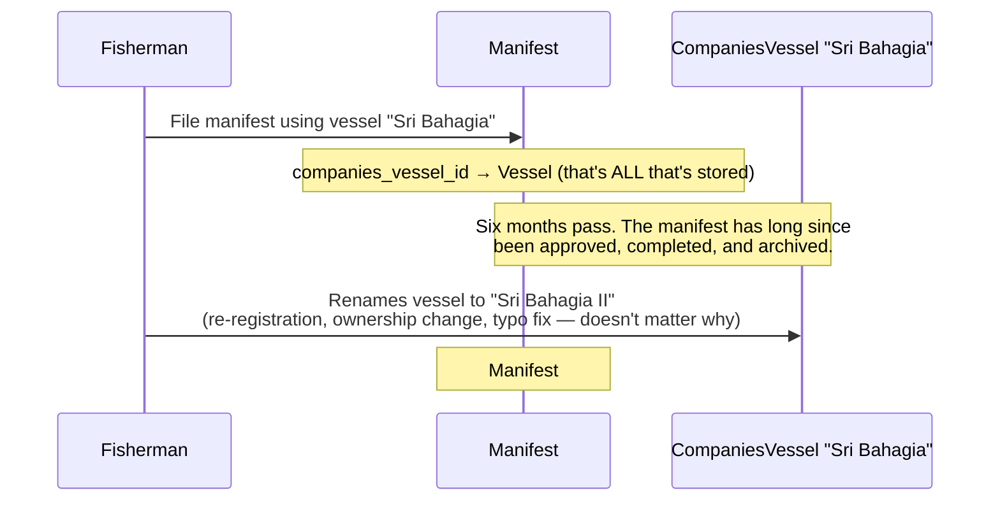

# Denormalized Snapshots — Why Manifest-Side Records Freeze Master Data

This doc explains a data-modeling pattern used throughout the manifest/capture-report side of this
app: certain columns deliberately **duplicate** a value from another table instead of only storing
a foreign key to it. This looks like it violates normalization — and it does, on purpose. This doc
covers what the pattern is, why it exists, everywhere it's applied today, everywhere it's
deliberately *not* applied, and how to add it correctly to a new field in the future.

Related: [`docs/ARCHITECTURE.md`](../ARCHITECTURE.md) §4 for the overall entity map this pattern
sits inside; `CLAUDE.md` "Never reuse a client-writable ... column as an internal type/role
discriminator" for a different but similarly-motivated data-integrity rule (`Role#kind`, see
[`docs/registration/business-flow.md`](../registration/business-flow.md) §2/§9).

---

## 1. The problem this solves

`Manifest`, `CrewManifest`, `CaptureReport`'s detail records, and `CompaniesFishingGear` all
reference **master/reference data** — records that someone can edit *after* the fact through their
own CRUD screens: `CompaniesVessel`, `CompaniesCrew`, `CompanyProfile`, `Port`, `ManifestSkipReason`,
`FishingGear`, `Dictionary`.

If a manifest only stored `companies_vessel_id` and rendered the vessel's name by following that
foreign key every time, this happens:



The manifest record itself never changed, but *what it appears to say* did — silently, with no
trace that it happened. That's the failure mode this pattern exists to prevent: **a record that
represents "what was true and declared at the time of a past event" must not be able to change
its own story just because something it points to was edited later.**

This matters concretely here because manifests, capture reports, and fishing-gear licenses are
regulatory/compliance records — fisheries authorities need "what vessel/crew/fee applied when this
was filed/approved" to stay a fixed historical fact, not a live join.

## 2. What "denormalization" means, concretely

Normalized design: store a fact exactly once, in the table that owns it, and reference it by
foreign key everywhere else. `CompaniesVessel.vessel_name` is the single source of truth for a
vessel's name; a normalized `Manifest` would just store `companies_vessel_id` and look the name up
through the association whenever it needs to display it.

**Denormalization**, as used here, means: keep the foreign key (for relational integrity — you can
still join, still cascade/restrict deletes, still know unambiguously *which* vessel), **and** also
copy the specific field values that matter for history onto the referencing record itself, captured
at the moment the reference was made. Two representations of overlapping data now exist on
purpose:

| | Lives on | Answers |
|---|---|---|
| `companies_vessel_id` (FK) | `Manifest` | "Which vessel record, right now, does this point to?" |
| `vessel_boat_name` (snapshot) | `Manifest` | "What was this vessel called when this manifest was filed?" |

Both are useful for different questions. The FK is for relational integrity and for "show me
everything this vessel is currently linked to" queries. The snapshot column is for "what did this
record actually say at the time" — and it's the snapshot, not the FK reach-through, that the API
renders back to the frontend for display.

## 3. The rule: when to snapshot, when to stay live

Not every `belongs_to` in this codebase needs a snapshot — doing that everywhere would be pointless
duplication for data that's supposed to track the present, not the past. The dividing line:

**Snapshot it when** the referencing record is documenting a **point-in-time event or declaration**
(a manifest was filed *using this vessel*; a fishing-gear license was approved *at this fee*), and
the thing it points to can be edited later by someone other than at that moment.

**Leave it live when** the association describes the **current state of the referencing record
itself**, where "the correct value" is genuinely defined as "whatever it is right now" — there's no
past moment being documented, so there's nothing to freeze. Example: `CompaniesCrew#position_id` —
a crew member's job title is an ongoing fact about them, not a record of a past event, so
`CompaniesCrewBlueprint` correctly renders it live via `association :position`. Same reasoning for
`CompaniesVessel#zone_id` (a vessel's current operating zone) and `User#role_id`/`User#company_profile_id`
(a user's current role/company).

Audit attribution (`created_by_id`, `reviewed_by_id`, `changed_by_id`) is a third, unrelated
category: showing the *current* name of whoever acted is standard/expected audit-log behavior, not
a gap — nobody expects an audit trail to freeze the actor's name as it was at the time.

## 4. The pattern, step by step

Every snapshot in this codebase follows the same five-part shape. Use this as the checklist for
adding a new one:

1. **Migration** — add a plain column (not a new association) to the referencing table, one per
   frozen field, commented `# Denormalized snapshot` on the first one in the block:
   ```ruby
   change_table :manifests, bulk: true do |t|
     t.string :support_vessel_name # Denormalized snapshot
     t.string :support_vessel_no
   end
   ```
   (Wrap in `safety_assured do ... end` — Strong Migrations can't inspect inside `change_table`
   blocks; see `db/migrate/20260806070002_add_support_vessel_snapshot_to_manifests.rb`.)

2. **Define the snapshot's field shape once, in a shared `Snapshots` collaborator — not inline
   in Create/Update.** Both the create path and the update-refresh path need the *identical* set of
   fields, and clearing a snapshot needs to null out exactly the same fields that setting it fills
   in. Writing that hash independently in two (or more) places is how they drift — a new field
   added on one side and forgotten on the other silently leaves stale data behind on whichever path
   didn't get updated. Instead, each namespace that has snapshots gets one plain class (not a
   `.call`/`Dry::Monads` service — it's a pure lookup-and-shape function, same shape as
   `SequenceGenerator`) with one class method per snapshot:
   ```ruby
   # app/services/manifests/snapshots.rb
   module Manifests
     class Snapshots
       def self.support_vessel(vessel)
         { support_vessel: vessel, support_vessel_name: vessel&.vessel_name, support_vessel_no: vessel&.boat_number }
       end
     end
   end
   ```
   Both `Manifests::Create` and `Manifests::Update` call `Snapshots.support_vessel(vessel)`; `Update`
   also calls `Snapshots.support_vessel(nil)` to clear it — same method, same field list, so a
   clear can never fall out of sync with a set. See `app/services/manifests/snapshots.rb` and
   `app/services/companies_fishing_gears/snapshots.rb` for the two current examples.

3. **Populate it server-side from the `Snapshots` collaborator, never accept it from the client.**
   The snapshot column is *not* added to any controller's permitted params — it's derived, the same
   way `vessel_boat_name` isn't client-writable today. Whichever service resolves the referenced
   record (usually already looking it up to validate it) merges `Snapshots.<field>(record)` in
   alongside it. On update, only re-derive the snapshot when the *id* field is actually present in
   the incoming attributes (`attributes.key?(:support_vessel_id)`) — untouched fields shouldn't be
   re-looked-up on every unrelated edit. If the id is cleared (optional association), pass `nil`
   through the same `Snapshots` method rather than hand-writing a second "clear" hash.

4. **Expose the snapshot field in the Blueprint, not a `.name`-style reach-through** on the live
   association. If the live association is still useful for other purposes (e.g. browsing full
   current master-data details), it's fine to keep both — see `CompaniesFishingGearBlueprint` (§5)
   for an example of a blueprint that renders both the frozen fields *and* the live association.

5. **Test it at the point where the snapshot is populated** (usually a controller/request test
   hitting the create/update endpoint) — assert the response includes the snapshot value matching
   the master record *at the time of the request*, not just that the id was accepted.

## 5. Full inventory — where this is applied

| Referencing model | Master data referenced | FK column | Snapshot column(s) | Shape defined in | Populated in | Exposed in |
|---|---|---|---|---|---|---|
| `Manifest` | `CompaniesVessel` (primary) | `companies_vessel_id` | `vessel_boat_name`, `vessel_boat_no` | `Manifests::Snapshots.vessel` | `Manifests::Create#snapshots`, `Manifests::Update#update_vessel_snapshot!` | `ManifestBlueprint`, `ManifestDetailBlueprint` |
| `Manifest` | `CompaniesCrew` (captain) | `captain_crew_id` | `captain_name`, `captain_ic_number` | `Manifests::Snapshots.captain` | `Manifests::Create#snapshots`, `Manifests::Update#update_captain_snapshot!` | `ManifestDetailBlueprint` |
| `Manifest` | `CompaniesVessel` (support) | `support_vessel_id` | `support_vessel_name`, `support_vessel_no` | `Manifests::Snapshots.support_vessel` | `Manifests::Create#snapshots`, `Manifests::Update#update_support_vessel_snapshot!` | `ManifestBlueprint`, `ManifestDetailBlueprint` |
| `Manifest` | `CompanyProfile` | `company_profile_id` | `company_name` | — (single field, inlined) | `Manifests::Create#build_manifest` (set once at creation only — `company_profile_id` is never client-editable after creation, so there's no update-side refresh) | `ManifestBlueprint`, `ManifestDetailBlueprint` |
| `Manifest` | `Port` (out) | `port_out_id` | `port_out_name` | `Manifests::Snapshots.port_name` | `Manifests::Create#port_snapshot`, `Manifests::Update#update_port_snapshot!` | `ManifestDetailBlueprint` |
| `Manifest` | `Port` (in) | `port_in_id` | `port_in_name` | `Manifests::Snapshots.port_name` | same as above | `ManifestDetailBlueprint` |
| `Manifest` | `ManifestSkipReason` | `skip_reason_id` | `skip_reason_name` | — (single field, inlined) | `Manifests::SkipCaptureReport#call` (the only place `skip_reason_id` is ever set) | `ManifestDetailBlueprint` |
| `CrewManifest` | `CompaniesCrew` | `companies_crew_id` (optional) | `crew_name`, `ic_number`, `passport_number`, `position`, `nationality`, `date_of_birth` (full copy) | — (inlined; predates this convention's write-up, not yet extracted) | `Manifests::SetCrew` | `CrewManifestBlueprint` (snapshot fields only — never reaches through `companies_crew`) |
| `FishingGearDetail` | `CompaniesFishingGear` | `companies_fishing_gear_id` (optional) | `name`, `gear_type`, `specification`, `quantity` (full copy) | — (inlined) | `FishingGearDetails::Create`/`Update` | `FishingGearDetailBlueprint` |
| `FishCaptureDetail` | `Dictionary` (fish species) | `dictionary_id` | `local_name`, `scientific_name`, `fish_type` | — (inlined) | `FishCaptureDetails::Create`/`Update`/`BulkSync` | `FishCaptureDetailBlueprint` |
| `CompaniesFishingGear` | `FishingGear` | `fishing_gear_id` | `fishing_gear_name`, `fishing_gear_type`, `fishing_gear_fee` | `CompaniesFishingGears::Snapshots.fishing_gear` | `CompaniesFishingGears::Create#call`, `CompaniesFishingGears::Update#attributes_for_update` | `CompaniesFishingGearBlueprint`, `CompaniesFishingGearApprovalBlueprint` (alongside the live `association :fishing_gear` — kept for browsing current master data; the snapshot fields are what represent history) |

**A field that looks like this pattern but isn't**: `Manifest#zone_area`, `#port_out_area`, and
`#port_in_area` sit right next to `zone_id`/`port_out_id`/`port_in_id` and *look* like snapshots of
`Zone#name`/`Port#port_name`, but they're actually plain client-submitted free text (permitted
directly in `manifest_params`), decoupled from the referenced record — the fisherman types an
"area" description, it isn't derived from the master row. `port_out_name`/`port_in_name` (added
2026-08-06, see §7) are the real, server-derived snapshots of `Port#port_name`; `port_out_area`/
`port_in_area` predate them and serve a different purpose (a human-written location description,
not a frozen copy of the port record).

**Not yet extracted**: `CrewManifest`, `FishingGearDetail`, and `FishCaptureDetail`'s snapshot
fields are still defined inline in their own `Create`/`Update` services rather than through a
shared `Snapshots` collaborator (§4 step 2) — they predate that convention being written down and
weren't touched during the 2026-08-06 refactor. Each is only built in one create-ish path and one
update-ish path today (no third caller yet), so the duplication risk is lower than `Manifests`
(four call sites) was, but the same extraction would apply cleanly if a third caller shows up or
the field list needs to change.

## 6. Deliberately left live (not a gap)

| Association | Why it stays live |
|---|---|
| `CompaniesCrew#position` → `Position` | Ongoing "what is this person's current job" fact, not a past event |
| `CompaniesVessel#zone` → `Zone` | Ongoing "what zone is this vessel currently licensed for" fact |
| `User#role`, `User#company_profile`, `User#company_profile_contact` | Current account state, not a historical declaration |
| `Role#permissions` | Authorization is evaluated against the current permission set by design — "what could this role do at signup time" isn't a meaningful question |
| `Manifest#created_by`, `CaptureReport#reviewed_by`, `ManifestHistory#changed_by` | Audit attribution — showing the actor's current name is standard practice, not drift |
| `CompaniesVessel#company_profile`, `CompaniesCrew#company_profile`, etc. (ownership FKs) | Ownership is a current-state fact ("who owns this vessel right now"), not a point-in-time declaration |

## 7. History — how this was audited (2026-08-06)

The full inventory in §5 wasn't designed up front; it was assembled by auditing the codebase in two
passes, plus a same-day structural cleanup pass, and is worth recording so a future audit doesn't
have to start from zero:

1. **Read every `app/models/*.rb`** for a `belongs_to` pointing at something editable outside the
   manifest flow, and checked whether a parallel plain column existed next to the FK.
   `vessel_boat_name`/`captain_name`/`company_name`/`zone_area` already existed (added at
   `db/migrate/20260617120018_create_manifests.rb`, commented "Denormalized snapshot"), confirming
   the convention was intentional from the start. `CrewManifest`, `FishingGearDetail`, and
   `FishCaptureDetail` were already fully covered too.

   Found one real gap this way: **`Manifest#support_vessel_id`** (added later, in
   `20260728100000_add_port_out_tracking_and_support_vessel_to_manifests.rb`, well after the
   original convention) had no snapshot columns at all — not even exposed as more than a bare id in
   the blueprints. Fixed in `20260806070002_add_support_vessel_snapshot_to_manifests.rb` +
   `Manifests::Create`/`Update`.

2. **Grepped every `app/blueprints/*.rb` for `association :x, blueprint: ...`** — a live
   reach-through into another table is the concrete, observable symptom of a missing snapshot (the
   API is *actively* serving current data as if it were historical). Confirmed every reach-through
   found was either a correctly-live current-state association (§6) or one of the child/detail
   associations Manifest genuinely owns (`crew_manifests`, `capture_reports`, etc. — not master
   data). One stood out as a real gap: **`CompaniesFishingGearBlueprint`/
   `CompaniesFishingGearApprovalBlueprint`** rendered `association :fishing_gear, blueprint:
   FishingGearBlueprint` with **zero** snapshot protection — editing `FishingGear.fee` (an
   admin-managed reference table) would retroactively change what fee every already-approved
   `CompaniesFishingGear` appeared to have been approved at. Fixed in
   `20260806071816_add_fishing_gear_snapshot_to_companies_fishing_gears.rb` +
   `CompaniesFishingGears::Create`/`Update`.

   Two smaller, lower-priority gaps found the same way — `Manifest#port_out_id`/`#port_in_id` →
   `Port#port_name`, and `Manifest#skip_reason_id` → `ManifestSkipReason#name` — were exposed as
   bare ids with no name at all (not even live). Fixed in the same session in
   `20260806071813_add_port_and_skip_reason_snapshot_to_manifests.rb` + `Manifests::Create`/
   `Update`/`SkipCaptureReport`.

All four fixes followed the exact §4 recipe and shipped together with request-level tests
(`test/controllers/api/v1/fisherman/manifests_controller_test.rb`,
`test/controllers/api/v1/company_profiles/vessels/fishing_gears_controller_test.rb`), a full
`bin/rubocop` pass, and `bin/brakeman`.

3. **SOLID follow-up pass, same day.** After landing the four fixes above, `Manifests::Create` and
   `Manifests::Update` had grown independent, near-identical hash literals for the same three
   snapshots (vessel/captain/support_vessel) — a Single-Responsibility/DRY smell: "what fields make
   up a vessel snapshot" was defined in two files, and `Update`'s captain/support-vessel *clear*
   paths were separate hardcoded hashes that had to be kept in sync with the *set* hashes by hand.
   `CompaniesFishingGears::Create`/`Update` had it worse — the fishing-gear snapshot method was
   *literally copy-pasted* between the two files. Extracted `Manifests::Snapshots` and
   `CompaniesFishingGears::Snapshots` (§4 step 2) to centralize each; also merged
   `Manifests::Update`'s two near-identical "approved company vessel" lookups (previously
   `update_vessel_snapshot!`'s inline `.find` and a separate `approved_support_vessel!` method) into
   one shared `approved_vessel!(manifest, company_profile, vessel_id, attribute_name)`. Net result:
   `Manifests::Update` dropped from 15 private methods (~130 lines, right at the `Metrics/ClassLength`
   limit) to 12 (~110 lines) with zero duplicated field lists, `CompaniesFishingGears::Update` lost
   its copy-pasted method entirely. Full test suite (344 tests), `bin/rubocop` (475 files), and
   `bin/brakeman` all still pass — this was a structural refactor, not a behavior change.

## 8. Related but different mechanisms (don't confuse these)

- **`ManifestHistory` / `Manifest`'s three AASM state machines** (`HasManifestHistory` concern) —
  this is an audit trail of *state transitions* (`port_out_status: pending → approved`, who did it,
  when, what remarks). It answers "what happened to this manifest's approval status over time." It
  has nothing to do with §1–7: it doesn't freeze *field values* from other tables, it records the
  manifest's *own* status changes.
- **The `Audited` gem** — present in the `Gemfile`, referenced in `CLAUDE.md`, but not currently
  `include`d by any model. It would give a record its own full version history (every attribute
  change, on that record). That's a different problem from this doc's: denormalization prevents a
  record from *silently inheriting* someone else's edit; `Audited` would let you look back at a
  record's *own* edit history. Neither is a substitute for the other.
- **`Discard` (soft delete)** — orthogonal. A discarded `ManifestSkipReason` or `CompaniesVessel`
  doesn't retroactively hide from existing FKs (Discard doesn't apply a default scope), so a
  discarded reference doesn't itself break historical rendering — but a *renamed* one still would,
  which is exactly why the snapshot pattern exists independently of Discard.

## Where to go deeper

- [`docs/ARCHITECTURE.md`](../ARCHITECTURE.md) — overall system/entity map
- `CLAUDE.md` — layering rules, the `Role#kind` worked example of a related-but-different
  data-integrity incident
- `app/services/manifests/create.rb`, `app/services/manifests/update.rb` — the canonical, most
  fully-worked example of this pattern (four separate snapshots in one service)
