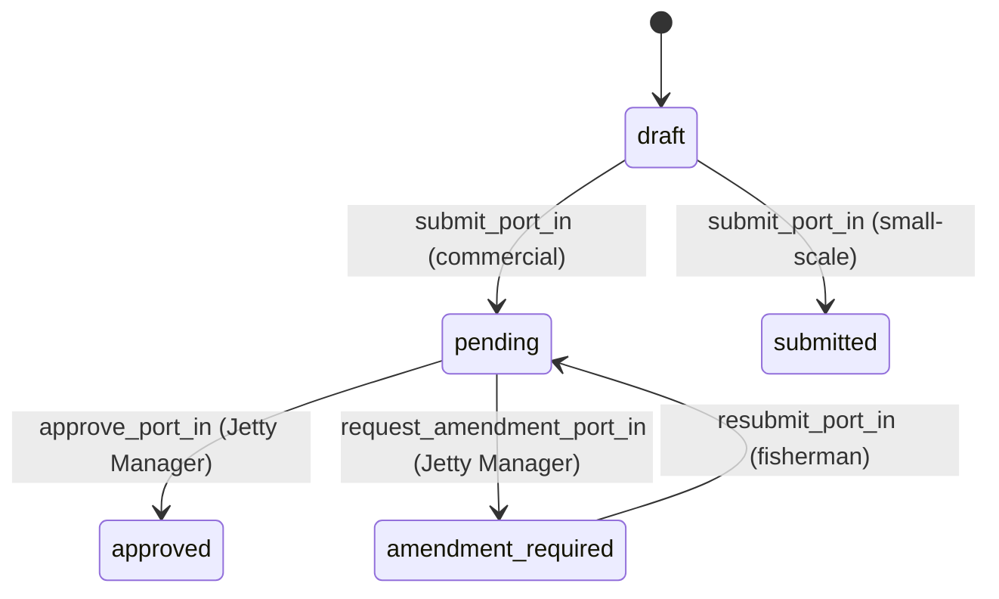
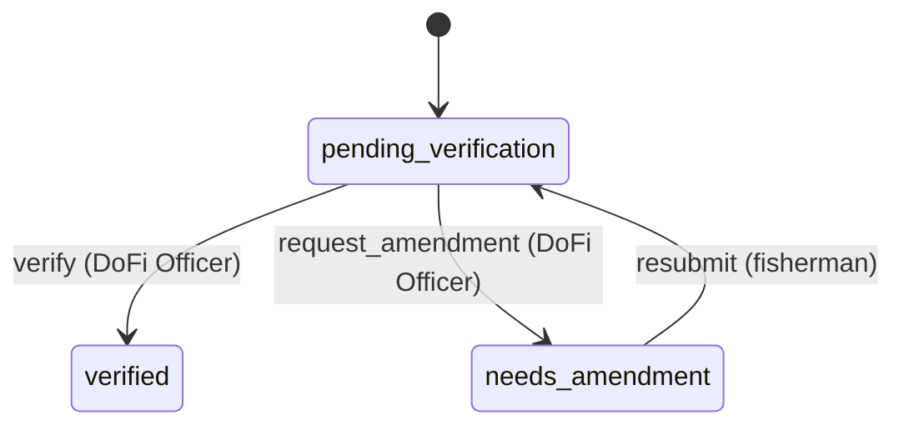
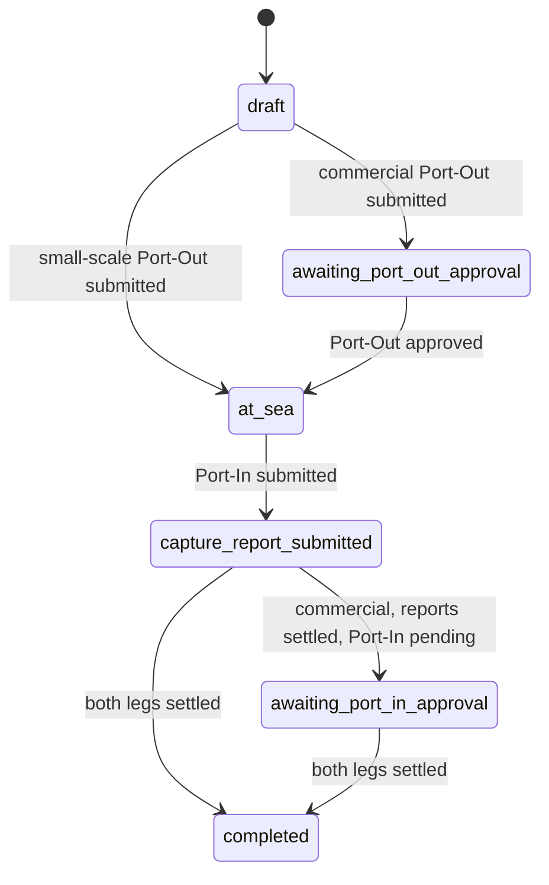

# Manifest lifecycle and statuses

A manifest records one fishing trip. Four status columns describe where it stands:

| Column | Table | What it tracks | Values |
|---|---|---|---|
| `port_out_status` | `manifests` | Leaving port | `draft`, `pending`, `amendment_required`, `approved`, `submitted` |
| `port_in_status` | `manifests` | Returning to port | `draft`, `pending`, `amendment_required`, `approved`, `submitted` |
| `capture_report_status` | `capture_reports` (one per report) | The catch report | `pending_verification`, `verified`, `needs_amendment` |
| `manifest_status` | `manifests` | **Summary** of the three above | `draft`, `awaiting_port_out_approval`, `at_sea`, `awaiting_port_in_approval`, `capture_report_submitted`, `completed` |

`manifest_status` is never set directly. It follows the other three: after a leg changes, the per-action service
fires the `manifest_status` event that applies, and the guards on those events decide whether the manifest may move
(see [Where the code lives](#where-the-code-lives)).

**Who acts**

| Actor | Does | Permission |
|---|---|---|
| Fisherman (company owner/admin) | Creates the manifest, submits and resubmits Port-Out / Port-In, writes and resubmits Capture Reports, skips the Capture Report with a reason | `manifests.*`, `capture_reports.*` |
| Jetty Manager | Approves or sends back **Port-Out** and **Port-In** (commercial only) | `manifest_approvals.approve`, `manifest_approvals.request_amendment` |
| DoFi Officer | Verifies or sends back **Capture Reports** | `capture_report_verifications.verify`, `capture_report_verifications.request_amendment` |

The two reviewers never wait for each other: the Jetty Manager can approve Port-In before the DoFi Officer has
verified the Capture Report, and the other way round.

## Port-Out


| Status | Meaning |
|---|---|
| `draft` | Not submitted yet; the fisherman can still edit the manifest |
| `pending` | Commercial: waiting for the Jetty Manager |
| `amendment_required` | The Jetty Manager sent it back; `port_out_amendment_remarks` holds why. The fisherman edits the same manifest, then resubmits |
| `approved` | Commercial: the Jetty Manager approved. The vessel may leave |
| `submitted` | Small-scale: no approval exists, submitting is enough |

Endpoints: `POST /api/v1/fisherman/manifests/:id/submit_port_out` and `.../resubmit_port_out`;
`POST /api/v1/admin/approvals/manifests/:id/approve_port_out` and `.../request_amendment_port_out`.

## Port-In



Same statuses and meanings as Port-Out, with one extra precondition: **the Capture Report step must exist**
before Port-In can be submitted — either at least one Capture Report was created, or the report was skipped with a
reason (`Manifest#capture_report_ready?`). Port-In details (port, area, time) are filled in with
`Manifests::Update` while the manifest is `at_sea` and Port-In is still `draft`. Submitting resets every Capture
Report to `pending_verification`.

Endpoints: `POST /api/v1/fisherman/manifests/:id/submit_port_in` and `.../resubmit_port_in`;
`POST /api/v1/admin/approvals/manifests/:id/approve_port_in` and `.../request_amendment_port_in`.

## Capture Report



| Status | Meaning |
|---|---|
| `pending_verification` | Waiting for a DoFi Officer; the fisherman can still edit it |
| `needs_amendment` | Sent back with `capture_report_remarks`; the fisherman edits it, then resubmits |
| `verified` | Accepted. `reviewed_by` and `reviewed_at` are stamped |

A manifest can have several reports; the verification leg is settled when **every** one is `verified`. The
fisherman can instead **skip** the report with a reason (`Manifests::SkipCaptureReport`, only while `at_sea`).
A manifest is either skipped or has reports, never both (model validations on both sides).

Endpoints: `POST /api/v1/admin/manifests/:manifest_id/capture_reports/:id/verify` and `.../request_amendment`;
`POST /api/v1/fisherman/manifests/:manifest_id/capture_reports/:id/resubmit`.

## Manifest status (the summary)



The `manifest_status` events, who fires them and when. The guards live in
[`Manifest::StatusWorkflow`](../../app/models/concerns/manifest/status_workflow.rb); a service fires an event only
when `may_<event>?` is true.

| Event | `manifest_status` | Fired by | When |
|---|---|---|---|
| `begin_port_out_review` | `draft` → `awaiting_port_out_approval` | `SubmitPortOut` | commercial: Port-Out is `pending` |
| `advance_to_sea` | `draft` → `at_sea` | `SubmitPortOut` | small-scale: Port-Out is `submitted` |
| `advance_to_sea` | `awaiting_port_out_approval` → `at_sea` | `ApprovePortOut` | the Port-Out was approved |
| `complete_capture_report` | `at_sea` → `capture_report_submitted` | `SubmitPortIn` | Port-In submitted |
| `begin_port_in_review` | `capture_report_submitted` → `awaiting_port_in_approval` | `SubmitPortIn`, `Verify`, `ResubmitPortIn`, `RequestAmendmentPortIn` | guard: commercial, Port-In `pending`, reports settled |
| `complete_manifest` | `capture_report_submitted` or `awaiting_port_in_approval` → `completed` | `SubmitPortIn`, `ApprovePortIn`, `Verify` | guard: both legs settled (below) |

## Completion rules

A manifest has two **independent legs**, each either *settled* or not. It completes when both are settled.

| Leg | Settled when |
|---|---|
| Port-In | Commercial: `port_in_status = approved`. Small-scale: `port_in_status = submitted` |
| Capture Reports | The report is skipped, **or** at least one report exists and every report is `verified` |

| Category | Port-In | Capture Reports | `manifest_status` |
|---|---|---|---|
| commercial | pending | pending / needs amendment | `capture_report_submitted` |
| commercial | approved | pending / needs amendment | `capture_report_submitted` |
| commercial | pending | all verified / skipped | `awaiting_port_in_approval` |
| commercial | approved | all verified / skipped | `completed` |
| small-scale | submitted | pending | `capture_report_submitted` |
| small-scale | submitted | all verified / skipped | `completed` |

Whichever leg finishes last completes the manifest, in either order. On completion the quantities on the reports'
fishing gear details are added to each gear's `usage_value` (`Manifests::RecordFishingGearUsage`), and
`capture_report_amendment_remarks` is cleared. Reports stay editable after Port-In approval: while a report is still
`pending_verification` or `needs_amendment` the officer can send it back and the fisherman can resubmit it, and the
manifest completes once every report is verified. A `verified` report is final.

The rules are executable in [`test/models/manifest_completion_rules_test.rb`](../../test/models/manifest_completion_rules_test.rb).
Who has to
approve what per fisherman category: [approval-rules-by-category.md](approval-rules-by-category.md).

## Amendments

Sending something back never creates a separate form. The reviewer's `remarks` are stored in a column, the
fisherman edits the **same record**, then calls the matching `resubmit_*`.

| Column | Set by | Cleared by |
|---|---|---|
| `port_out_amendment_remarks` | `request_amendment_port_out` | `approve_port_out`, `resubmit_port_out` |
| `port_in_amendment_remarks` | `request_amendment_port_in` | `approve_port_in`, `resubmit_port_in` |
| `capture_report_amendment_remarks` | any Capture Report event, recomputed from the latest report in `needs_amendment` | the last report being verified (none left in `needs_amendment`) |

These are denormalised copies so list and detail responses don't query the history table; see
[denormalized-snapshots.md](../data-model/denormalized-snapshots.md). The Port-Out / Port-In services write their own column when they fire the event;
[`Manifest::AmendmentSnapshots`](../../app/models/concerns/manifest/amendment_snapshots.rb) recomputes the Capture
Report one.

## History and notifications

**History.** Every transition of every status column writes a `manifest_histories` row (`status_type`, `action`,
`from_state`, `to_state`, `changed_by`, `remarks`). It is automatic (`HasManifestHistory`), because an audit trail must
never depend on a caller remembering it. The cascaded manifest-status rows carry the actor of the step that caused them.

**Notifications** (`Notifications::ManifestPublisher`, sent by the per-action services after a successful transition):

| Event | Sent to | When |
|---|---|---|
| `port_out_review_required` | Port-Out approvers | commercial Port-Out submitted |
| `port_out_approved`, `port_out_amendment_required` | Fishermen | Jetty Manager acts |
| `port_out_resubmitted` | Port-Out approvers | fisherman resubmits |
| `port_in_review_required` | Port-In approvers | commercial Port-In submitted, **without waiting for verification** |
| `capture_report_review_required` | Capture verifiers | Port-In submitted and there are reports to verify |
| `port_in_approved`, `port_in_amendment_required` | Fishermen | Jetty Manager acts |
| `port_in_resubmitted` | Port-In approvers | fisherman resubmits |
| `capture_report_verified`, `capture_report_amendment_required` | Fishermen | DoFi Officer acts |
| `capture_report_resubmitted` | Capture verifiers | fisherman resubmits |

## Where the code lives

The rule of the repo applies: **controller → service → model → blueprint**. The models describe the shape of the
state machines; the per-action service fires the events.

```
Controller -> per-action service (Manifests::ApprovePortIn, CaptureReports::Verify, ...)
                 lock the manifest -> may_<event>? -> fire the AASM event -> write the remarks column
                   -> fire the manifest_status events the guards now allow (may_complete_manifest? ...)
                   -> Manifests::RecordFishingGearUsage   when the manifest completes
                 then notify (Notifications::ManifestPublisher)
```

Each service fires its events literally, in this order:

| Service | Events it fires |
|---|---|
| `Manifests::SubmitPortOut` | `submit_port_out!`, then `begin_port_out_review!` (commercial) or `advance_to_sea!` (small-scale) |
| `Manifests::ApprovePortOut` | `approve_port_out!`, `advance_to_sea!` |
| `Manifests::RequestAmendmentPortOut` | `request_amendment_port_out!` |
| `Manifests::ResubmitPortOut` | `resubmit_port_out!` |
| `Manifests::SubmitPortIn` | `submit_port_in!`, `complete_capture_report!`, then `complete_manifest!` if allowed, otherwise `begin_port_in_review!` if allowed |
| `Manifests::ApprovePortIn` | `approve_port_in!`, then `complete_manifest!` if allowed |
| `Manifests::RequestAmendmentPortIn` | `begin_port_in_review!` if allowed (heals a manifest left behind its legs), then `request_amendment_port_in!` |
| `Manifests::ResubmitPortIn` | `resubmit_port_in!`, then `begin_port_in_review!` if allowed |
| `CaptureReports::Verify` | `report.verify!`, then `complete_manifest!` if allowed, otherwise `begin_port_in_review!` if allowed |
| `CaptureReports::RequestAmendment` | `report.request_amendment!` |
| `CaptureReports::Resubmit` | `report.resubmit!` |

| Piece | File |
|---|---|
| Port-Out / Port-In / manifest-status tables, guards, history | [`app/models/concerns/manifest/`](../../app/models/concerns/manifest/) (`port_out_workflow`, `port_in_workflow`, `status_workflow`) |
| Which leg is settled | `port_in_settled?` in `port_in_workflow`, `capture_reports_settled?` in [`capture_report_state`](../../app/models/concerns/manifest/capture_report_state.rb) |
| Capture Report table, `unverified` scope | [`app/models/capture_report.rb`](../../app/models/capture_report.rb) |
| The user-facing actions | `app/services/manifests/*`, `app/services/capture_reports/*` |

**Why a lock.** Jetty approval and DoFi verification are separate requests. Without it each could judge the other's
step unfinished and leave a fully approved manifest stuck. `SubmitPortIn`, `ApprovePortIn` and `Verify` re-read the
manifest under `with_lock`, so the guards always see the other leg's committed state.

**Only these services fire events.** Nothing else (controller, model, job, another service) may call a lifecycle
event: it would skip the remarks, the manifest status follow-up and the notification.
[`test/architecture/lifecycle_events_only_in_services_test.rb`](../../test/architecture/lifecycle_events_only_in_services_test.rb)
fails if one does, and also if a service completes a manifest without calling `RecordFishingGearUsage`. Tests and
seeds drive the lifecycle through the same services. The machines set `whiny_persistence: true`, so an event that
cannot save raises instead of returning `false`.
