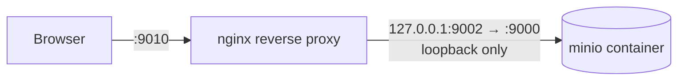
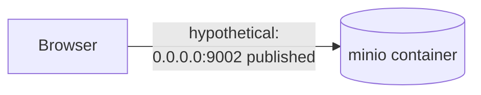

# MinIO — Frequently Asked Questions

Answers to questions that come up once someone actually starts working with the MinIO setup, past
what the architecture/setup docs cover directly. Each answer gives the short version plus the
reasoning, and points back to the doc that has the full mechanics — this one doesn't replace
`docs/minio/MINIO.md`, it's the FAQ layer on top of it. Recorded from an internal discussion
(2026-07-29) so the reasoning doesn't have to be re-derived next time the same question comes up.

---

## Q: Do image URLs from the API have to go through the reverse proxy?

**Short answer: yes, today — by deliberate design, not because of cryptography.**

A common way this question gets asked: "can't we just build the URL as
`http://<server-ip>:9010/dofi-staging-public/<key>` and hit MinIO directly, instead of browser →
nginx → MinIO?"

Worth untangling first: that URL **already goes through nginx**. Port `9010` in that example is
the reverse proxy's public port (see `docs/minio/MINIO-PUBLIC-PROXY-SETUP.md`), not MinIO's own port.
MinIO itself is published as `127.0.0.1:9002:9000` — loopback only (`docker-compose.staging.yml`,
`docker-compose.production.yml`). From outside the server, that port is unreachable no matter what
URL you type. So today there's no way to skip the proxy even by hand-crafting a URL.



**Could the proxy be removed entirely, in principle?** Yes — nothing about presigning or anonymous
`GetObject` requires nginx specifically:

- **Public bucket**: anonymous access has no signature to verify at all — a direct hit to MinIO's
  port would work exactly the same.
- **Private bucket**: presigning is a local SigV4 computation, signed against whatever
  `MINIO_PUBLIC_ENDPOINT` is configured (`MINIO.md` §2). If that env var pointed straight at a
  publicly-exposed MinIO port, the signature would still validate — the proxy isn't part of the
  auth mechanism, MinIO's own signature check is.



**Why this isn't how it's actually deployed** — `MINIO.md` §10 is explicit that MinIO's port is
"never published to a public interface in any compose file... this is deliberate":

| What the proxy buys you | Cost of going direct instead |
|---|---|
| TLS/HTTPS termination (certbot etc. is a solved problem on nginx) | Would need TLS configured on MinIO's own S3 listener instead — more awkward |
| Reuses the server's existing nginx + firewall/security-group rules already open for other apps | A new port to open and manage per server |
| One consolidated public entry point, one place to add rate limiting / IP allowlisting / WAF later | MinIO's admin-capable service directly fingerprintable from the internet — more attack surface, even though the app only ever uses scoped credentials |
| Today's proxy is plain HTTP with no auth beyond MinIO's own signature check — but it's the one place to bolt that on later | Nothing to bolt onto if there's no proxy in the path |

Bottom line: not cryptographically mandatory, but it's the security boundary this repo has chosen,
and changing it means deliberately re-publishing MinIO's port to `0.0.0.0` — a real architecture
change, not just a URL string choice.

See also: `docs/minio/MINIO.md` §2 (Architecture) and §10 (Security notes),
`docs/minio/MINIO-PUBLIC-PROXY-SETUP.md`.

---

## Q: Does MinIO have a dashboard, like Cloudinary's, to check if a file actually uploaded?

**Yes — MinIO ships a web Console — and it's already enabled in this repo's containers, just not
exposed.**

Every compose file already starts MinIO with a console address:

```
command: server /data --console-address ":9001"   # docker-compose.staging.yml, production.yml, production.local.yml
```

But `ports:` only publishes `127.0.0.1:9002:9000` (the S3 API) — port `9001` (the Console) isn't
published anywhere, so it's unreachable from outside the container as deployed today.

**To use it anyway (staging/production), SSH-tunnel to it rather than publishing the port:**

```bash
ssh -L 9001:127.0.0.1:9001 <user>@<server>
# then open http://localhost:9001 in a browser, log in with MINIO_ROOT_USER / MINIO_ROOT_PASSWORD
```

**Caveat:** per `docs/minio/MINIO.md` §1, MinIO moved the full Console GUI behind a paid tier in 2025
(the product rebrand to AIStor) — the pinned image
(`minio/minio:RELEASE.2025-04-08T15-41-24Z`) may show a reduced feature set or an upgrade prompt.
This is exactly why this repo never relies on the Console for anything — provisioning
(`docker/mc-init.sh`) and inspection both go through the `mc` CLI / S3 API instead, which stays
free regardless of Console licensing changes.

**The reliable, already-documented way to check uploads** (`docs/minio/MINIO.md` §7, "Inspecting
bucket contents"):

```bash
docker run --rm --network <compose network, e.g. dofi-backend-staging-net> \
  -e MC_HOST_local="http://<ACCESS_KEY_ID>:<SECRET_ACCESS_KEY>@minio:9000" \
  minio/mc ls local/<BUCKET>
```

Swap in either bucket's credentials/name — works the same for private or public.

---

## Q: Can we put a CDN in front of the public bucket for performance?

**Yes for the public bucket — and it's already anticipated in the architecture. No for the private
bucket, never.**

The two buckets differ exactly on the axis that matters for caching
(`docs/minio/MINIO-WHY-TWO-BUCKETS.md`, comparison table):

| | Public bucket (`MINIO_ASSETS_BUCKET`) | Private bucket (`MINIO_BUCKET`) |
|---|---|---|
| URL shape | Plain, unsigned, **non-expiring** | Presigned, **5-minute expiry** |
| Same key → same URL forever? | Yes | No — a new signature every request |
| Cacheable by a CDN/proxy? | **Yes** | **No** — caching an expired/reused presigned URL either breaks the request or leaks access across users |

`docs/minio/MINIO.md`'s retrieval-flow diagram already leaves the door open for this: "`GET image_url
(browser — direct, or via reverse proxy/CDN later)`" — i.e. this was scoped out of the original
two-bucket work, not ruled out.

**Options, cheapest first:**

1. **nginx `proxy_cache` on the existing vhost.** Caches responses to local disk on the same
   server — no new external dependency, smallest change. Reduces repeat hits to the MinIO
   container itself, but doesn't get you geographic/edge distribution.
2. **A real CDN** (Cloudflare or similar) in front of the nginx vhost. Adds edge caching close to
   end users, plus incidental TLS/DDoS benefits.
3. **Both** — CDN at the edge, nginx cache as an origin shield behind it.

**Two things to fix before either option pays off:**

- The current proxy config (`docs/minio/MINIO-PUBLIC-PROXY-SETUP.md`) is a bare passthrough —
  `proxy_pass` + `Host` header only, no `Cache-Control`/`ETag` handling. A cache (local or CDN)
  needs something to key off; add `Cache-Control` headers (via MinIO's own object metadata at
  upload time, or `add_header` in nginx) before turning on caching.
- **Data sovereignty.** `docs/minio/MINIO.md` §1 states the reason this app self-hosts MinIO instead
  of using Cloudinary in the first place: "the client (Brunei government) provides dedicated
  servers instead of shared cloud hosting... a data-sovereignty win, not just a cost one." A global
  commercial CDN caches bytes in foreign PoPs, which may run into the same concern that ruled out
  Cloudinary. Worth a explicit sign-off from the client/stakeholder before adopting an external
  CDN — option 1 (nginx `proxy_cache`, stays on the government's own server) is the safer default
  if that hasn't been confirmed.

---

## See also

- `docs/minio/MINIO.md` — architecture, env vars, day-2 ops, troubleshooting (the source of truth).
- `docs/minio/MINIO-WHY-TWO-BUCKETS.md` — why public/private buckets are split the way they are.
- `docs/minio/MINIO-PUBLIC-PROXY-SETUP.md` — step-by-step reverse-proxy setup tutorial.
- `docs/minio/MINIO-TWO-BUCKET-SETUP.md` — what changed in the two-bucket migration, and how to
  test/deploy it.
