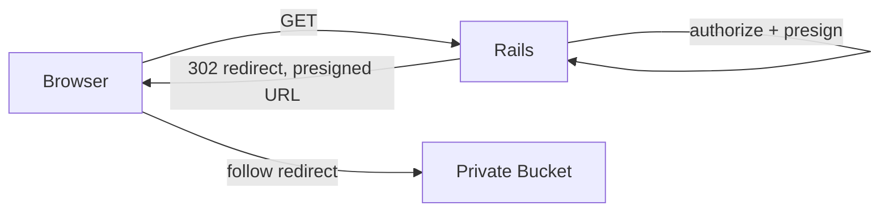
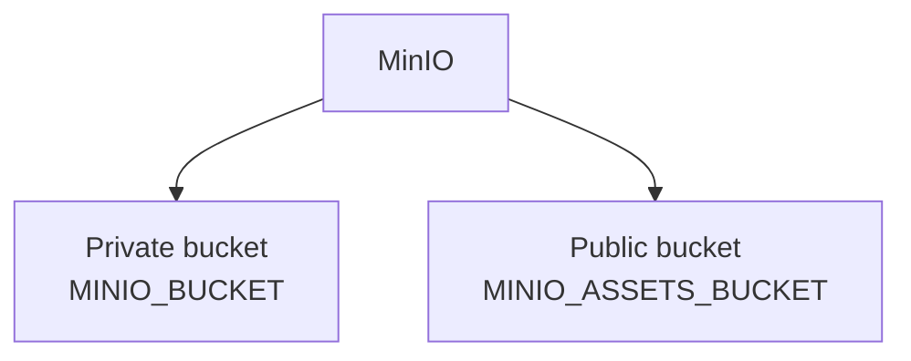
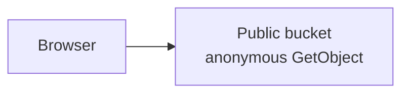
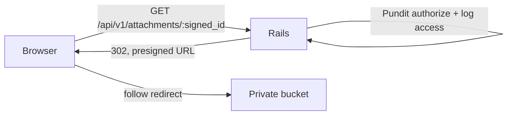

# Why Two MinIO Buckets? (Public vs Private Rationale)

This doc answers a question that comes up whenever someone new looks at the MinIO setup:

> **"If a private bucket can still serve a file to the browser via a presigned URL, why do we
> need a public bucket at all? Isn't the file visible either way?"**

It's a fair question — **both architectures end with the browser displaying the image.** The
difference is *how* the file is reached, not *whether* it's ultimately visible. This is the
conceptual "why" behind the design; for the mechanics (env vars, credentials, bucket names,
policies) see `docs/minio/MINIO.md` §2 "Public vs private buckets" — that table is the source of truth
for what actually exists today. This doc doesn't duplicate it, just explains the reasoning behind
it.

---

## Option 1 — Everything in one private bucket

Every object — identity documents and fish-reference photos alike — lives in one bucket that
rejects unsigned requests. The browser never talks to MinIO directly; every single object fetch
round-trips through Rails first:

This is a perfectly valid, simple architecture — one bucket, one credential, one access pattern,
every request passes through application authorization. Plenty of internal systems (HR, hospital,
finance — see "When a single private bucket is enough" below) should stop right here.

### The downside

The problem shows up once the app also has assets that were **never meant to be gated** — things
like reference images or public-facing media, where there is no user-specific access decision to
make. In this repo that's `Dictionary` images (fish-species reference photos, part of the public
catalog every fisherman/officer already sees regardless of role).

With everything forced through one private bucket, Rails still does full authorize-and-presign
work for objects that didn't need protecting in the first place. It doesn't matter that the
*answer* is always "yes, allowed" — the app still pays for asking. That cost scales with traffic,
not with how sensitive the data actually is:

| | Private-only, for a public asset |
|---|---|
| Browser requests | N |
| Rails authorization checks | N (always trivially "yes") |
| Presigned URLs generated | N (each recomputed, `Attachments::PublicUrl::EXPIRES_IN = 5.minutes`) |
| Redirects | N |
| Extra round trip per image | 1 (browser → Rails → 302 → MinIO, instead of browser → MinIO) |

None of that buys anything for content that was always going to be served — it's pure overhead on
the request path for zero additional security.

---

## Option 2 — Separate public and private buckets (what this repo does)

Objects are classified by sensitivity at the model level, and each tier gets its own bucket, own
scoped credentials, and own MinIO access policy (see `docs/minio/MINIO.md` §2's table for the exact env
vars and policy names):

**Public bucket today:** `Dictionary` images only (`app/models/dictionary.rb`, via
`service: Rails.application.config.x.active_storage_public_service`). Anything added later that's
similarly non-gated — event posters, org logos, avatars — is a candidate for this tier, not
something already implemented; see `docs/minio/MINIO.md` §4 before wiring a new model to either tier.

**Private bucket:** everything else — the app-wide default when a model attaches a file with no
`service:` override. Identity/licence-style documents belong here once the app grows them.

### Public access flow — Rails is bypassed entirely

`Attachments::AssetUrl` (`app/services/attachments/asset_url.rb`) returns the object's plain,
**unsigned, non-expiring** URL directly in the JSON payload. No controller action, no redirect, no
signature:

The public bucket's MinIO policy grants anonymous `s3:GetObject` (provisioned by
`docker/mc-init.sh`) but keeps `ListBucket` denied, so individual objects are world-readable
without the bucket itself being enumerable.

### Private access flow — same authorization path as before

Sensitive documents still go through `Api::V1::AttachmentsController#show`
(`app/controllers/api/v1/attachments_controller.rb`): resolve the signed blob ID, `authorize
attachment.record, :show?` via Pundit, log the access decision either way, then redirect to a
presigned URL from `Attachments::PublicUrl` (5-minute expiry):

Nothing about this flow changes with the two-bucket split — it's exactly Option 1's flow, just
now scoped to the objects that actually need it.

---

## "But users can still see the image" — yes, and that's not the point

A **private** object doesn't mean the user will never receive the file. It means:

> The application decides, on every request, whether this specific user is allowed to receive
> this specific file — and that decision is worth paying for.

For a `Dictionary` image, that decision is always "yes, unconditionally" for every authenticated
user — so the check itself has no value, only cost. For a boat licence, the decision genuinely
depends on who's asking, so the same check is exactly the point. The two-bucket split just makes
sure the expensive path is only used where the answer can actually be "no."

---

## Comparison

| | Public bucket (`MINIO_ASSETS_BUCKET`) | Private bucket (`MINIO_BUCKET`) |
|---|---|---|
| Example content | `Dictionary` images (today); future: posters, logos, avatars | Future: identity documents, licences — anything Pundit should gate |
| Rails involved on read? | No | Yes — `Api::V1::AttachmentsController` |
| URL shape | Plain, unsigned, non-expiring | Presigned, 5-minute expiry, via `302` |
| Access decision | None — anonymous `GetObject` | Pundit `authorize ..., :show?` on every request |
| Cacheable by a CDN/proxy? | Yes | No — URL changes every request |
| Service objects | `Attachments::AssetUrl` | `Attachments::PublicUrl` |

## When is a single private bucket enough?

Skip the two-bucket split if the app has **no** assets that are unconditionally visible to
everyone — every internal HR/hospital/finance-style system fits this. The split only pays for
itself once there's a real population of requests where the authorization answer is always "yes"
and checking it anyway is pure overhead. That's the situation `Dictionary` created here.

## See also

- `docs/minio/MINIO.md` §2 "Architecture" — the mechanics this doc explains the reasoning for (env vars,
  credential scoping, bucket-policy details).
- `docs/minio/MINIO.md` §4 — how to attach a new model to either tier.
- `docs/minio/MINIO-TWO-BUCKET-SETUP.md` — what changed when the split was introduced, and how to
  test/deploy it.
- `docs/incidents/POSTMORTEM-2026-07-27-minio-presigned-url.md` — the incident that led to the
  internal/public **endpoint** split (a different axis from the bucket split described here; see
  the postmortem's update note for how the two ended up related).
