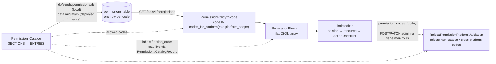

# Permission Catalog: Source of Truth for the Permission List

[`Permission::Catalog`](../../app/models/concerns/permission/catalog.rb) is the **only** place that
defines which permissions exist and how they are presented. It holds every canonical permission code,
the platform that may hold each one, and the section/resource/action grouping, labels, and ordering the
Role editor uses to render its checklist. Nothing else in the codebase (and nothing in the frontend)
should keep its own list of codes, labels, or display order.

Related: [`platform-company-isolation.md`](platform-company-isolation.md) for the wider RBAC model
(§2.4 Permission, §4.3 Seeds, §9.1 Adding a permission);
[`docs/api/search-filter-sort-pagination.md`](../api/search-filter-sort-pagination.md) for the
Ransack filters `GET /api/v1/permissions` accepts.

---

## 1. What the catalog decides

| Question | Answered by | Read by |
| --- | --- | --- |
| Which permission codes exist? | `ENTRIES` / `CODES` | seeds, role create/update validation, permission list scope |
| Which platform may hold a code? | each action's platform key (`shared` / `dofi_officer` / `fisherman`) | `codes_for_platform`, `Roles::PermissionPlatformValidation` |
| How is the list grouped and ordered? | order of `SECTIONS`, its `resources`, and each action array | `section_order` / `resource_order` / `action_order` in the API response |
| What text does the UI show? | `label` on sections and resources, `action_labels` (or `action.titleize`) on actions | `section_label` / `resource_label` / `name` in the API response |
| Which policy owns a resource? | `resource` key == the policy's `permission_resource` | `bin/rbac-lint`, `test/policies/rbac_contract_test.rb` |

The `permissions` table still exists: roles link to permission rows by id through
`permission_roles`. The table is a persisted copy of the catalog, not a second definition. Section 5
covers how the two stay in sync.

---

## 2. From catalog to the Role editor



A code shows up in the list only when it exists in **both** places: it is in the catalog **and** it
has a row in `permissions`.

- **Only in the catalog, with no row** (for example, a new code added without a data migration): it
  isn't listed and can't be assigned.
- **Only a row, with no catalog entry** (a legacy code left behind during a rollout): the scope hides
  it, and role create/update rejects it.

---

## 3. Shapes

The same examples are written as comments above each constant in
[`catalog.rb`](../../app/models/concerns/permission/catalog.rb).

### 3.1 `SECTIONS`: the hand-written definition

This is the only part you edit. It is a nested array of section, then resource, then actions:

```ruby
{ key: "manifest", label: "Manifest", resources: [
  { key: "manifest_approvals", label: "Manifest Approvals",
    dofi_officer: %w[list view approve request_amendment],
    action_labels: { "approve" => "Approval Port In/Port Out",
                     "request_amendment" => "Amendment Port In/Port Out" } }
] }
```

| Key | Level | Meaning |
| --- | --- | --- |
| `key` | section | Stable section identifier, rendered as `section` |
| `label` | section | Section heading, rendered as `section_label` |
| `resources` | section | Ordered resources in this section |
| `key` | resource | Code prefix (`<key>.<action>`), and the policy's `permission_resource` |
| `label` | resource | Resource row label, rendered as `resource_label` |
| `shared` / `dofi_officer` / `fisherman` | resource | Ordered actions available to that platform. An action appears under exactly one key. |
| `action_labels` | resource | Optional `{ action => display name }` override. The default is `action.titleize` (`request_amendment` becomes "Request Amendment"). |

### 3.2 `ENTRIES`: one frozen Hash per code

`SECTIONS` is flattened into `ENTRIES` in display order. Example element:

```ruby
{
  code: "manifest_approvals.approve",
  action: "approve",
  action_order: 3,
  name: "Approval Port In/Port Out",
  platform_scope: "dofi_officer",
  resource: "manifest_approvals",
  resource_label: "Manifest Approvals",
  resource_order: 2,
  section: "manifest",
  section_label: "Manifest",
  section_order: 2
}
```

All three `*_order` values are 1-based positions within their parent: `section_order` within
`SECTIONS`, `resource_order` within the section, and `action_order` within the resource. Inside a
resource, actions are counted `shared` first, then `dofi_officer`, then `fisherman`.

### 3.3 Derived lookups

| Constant / method | Shape | Used for |
| --- | --- | --- |
| `BY_CODE` | `{ "manifest_approvals.approve" => <entry>, ... }` | `Permission::Catalog.fetch(code)`, `Permission::CatalogRecord` |
| `CODES` | `["dashboard.list", "manifests.list", ...]` | "is this a canonical code?" checks, seeds |
| `RESOURCES` | `{ "manifest_approvals" => [<entry>, ...], ... }` | RBAC contract test (one policy per resource) |
| `codes_for_platform(platform)` | `["dashboard.list", ...]`: the platform's own codes plus `shared` | permission list scope, `Permission.assignable_to` |

---

## 4. `GET /api/v1/permissions`: what the frontend receives

Any authenticated user can call this endpoint (`PermissionPolicy#index?` is unconditional). The
policy scope limits the rows to the caller's platform:

- DoFi Officer platform: `shared` codes plus `dofi_officer` codes
- Fisherman platform: `shared` codes plus `fisherman` codes

The response is **one flat, unpaginated array**, one object per code:

```json
{
  "status": "success",
  "data": [
    {
      "id": "3f1c…",
      "action": "approve",
      "action_order": 3,
      "code": "manifest_approvals.approve",
      "name": "Approval Port In/Port Out",
      "platform_scope": "dofi_officer",
      "resource": "manifest_approvals",
      "resource_label": "Manifest Approvals",
      "resource_order": 2,
      "section": "manifest",
      "section_label": "Manifest",
      "section_order": 2
    }
  ]
}
```

To render the checklist:

1. Group by `section`, then by `resource`.
2. Sort sections by `section_order`, resources by `resource_order`, and actions by `action_order`.
   The API sorts by `code asc` by default, which is **not** the display order. The `*_order` fields
   aren't Ransack-sortable, so sort on the client.
3. Show `section_label`, `resource_label`, and `name` (the action's display name). Don't hardcode or
   derive these labels in the frontend.
4. To save a role, send the selected `code` values as `permission_codes` to
   `POST/PATCH /api/v1/admin/roles` or `/api/v1/fisherman/roles`. Don't send the permission `id`.

---

## 5. Live vs persisted fields

Each field in the response comes from one of two places. Some fields are read from the catalog on
every request. The rest are stored as columns, and
[`Permission::CatalogRecord`](../../app/models/concerns/permission/catalog_record.rb) copies them
from the catalog **only when a row is saved**. This decides whether a catalog edit shows up on deploy
by itself or needs a data migration:

| Field | Source | A catalog edit shows up… |
| --- | --- | --- |
| `action`, `action_order`, `resource_label`, `section_label` | read live from `BY_CODE` | on deploy |
| `name`, `platform_scope`, `section`, `section_order`, `resource_order` | persisted column, synced on save | after a data migration resyncs the row |
| `resource` | persisted column, derived from `code` on save | after a data migration resyncs the row |
| `id`, `code` | persisted column | (identity, never changes silently) |

Deployed environments run only `bin/rails db:prepare`. They never run `db:seed`, so any change that
touches a persisted field has to ship a data migration that resyncs or creates the affected rows.
`platform_scope` is the one exception for access control: filtering and validation always read the
catalog, so a stale column can show an outdated value but can never leak a code across platforms.

---

## 6. Invariants

| Rule | Enforced by |
| --- | --- |
| Only catalog codes are ever listed | `PermissionPolicy::Scope#resolve` filters by `codes_for_platform` |
| A platform never sees another platform's codes | `codes_for_platform`, which reads the catalog, not the persisted column |
| A role can't be assigned a non-catalog or cross-platform code | `Roles::PermissionPlatformValidation`, used by `Roles::Create`/`Update` |
| Every catalog resource has exactly one policy, and every policy's resource is in the catalog | `bin/rbac-lint`, `test/policies/rbac_contract_test.rb` |
| Labels and ordering exist in one place | Convention and review: no code/label/order list in seeds, services, or the frontend |

---

## 7. Changing the catalog

| Change | Edit the catalog | Data migration needed? |
| --- | --- | --- |
| Rename a section or resource label | `label` | No (read live) |
| Reorder actions within a resource | the action array | No (`action_order` is live) |
| Rename an action's display name | `action_labels` | **Yes**: resync `name` on those rows |
| Reorder sections or resources | array order | **Yes**: resync `section_order`/`resource_order` on the moved rows |
| Add an action or resource | action array / `resources` | **Yes**: create the rows and grant them to roles (see [RBAC §9.1](platform-company-isolation.md#91-adding-a-permission)) |
| Rename a code | resource `key` or action name | **Yes**: rename the rows in place so `permission_roles` grants survive. The precedent is `db/migrate/20260923100000_rename_admin_accounts_to_external_users.rb`. |
| Move an action to another platform | move it to another platform key | **Yes**: resync `platform_scope` and strip now-invalid grants (see `20260916100000_strip_cross_platform_permission_grants.rb`) |

Inserting a section, resource, or action in the middle of its array shifts the order of the siblings
after it, so resync those rows too.

To resync rows, copy `resync_permission_metadata` in
`db/migrate/20260916100000_strip_cross_platform_permission_grants.rb`. It declares a migration-local
model and calls `update_columns` with values from `Permission::Catalog::BY_CODE[code]`. Also write
`name` if an action label changed, since that migration doesn't. Keep the migration off the app
`Permission` model so a future change to the model can't break an old migration.

Locally, `bin/rails db:seed` (run inside the `api` container under Docker) re-applies the catalog.
Pair every data migration with a `test/db/*_test.rb`, and finish with `bin/rbac-lint`,
`bin/rubocop`, and `bin/rails test`.
