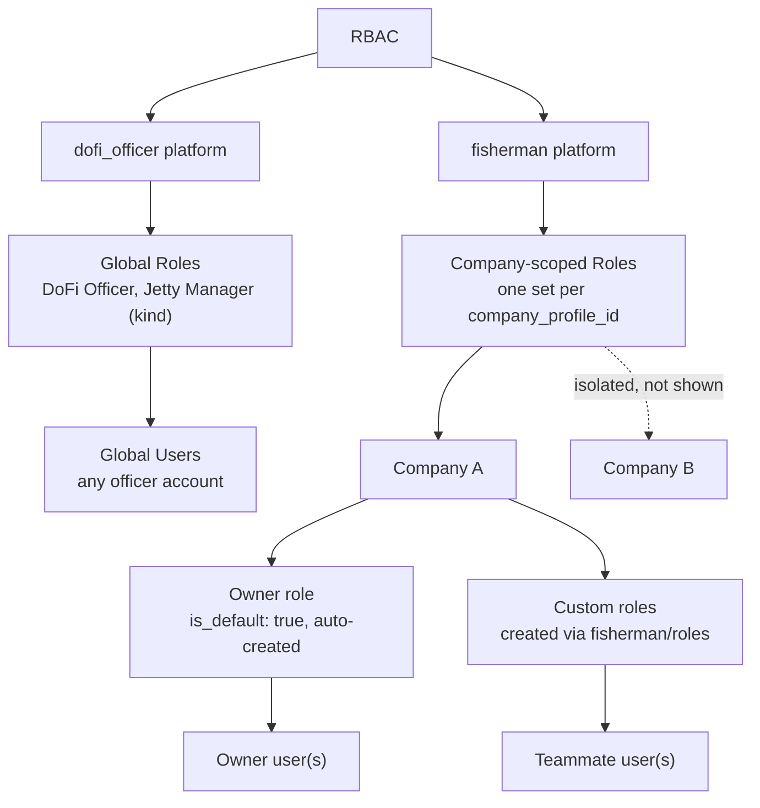
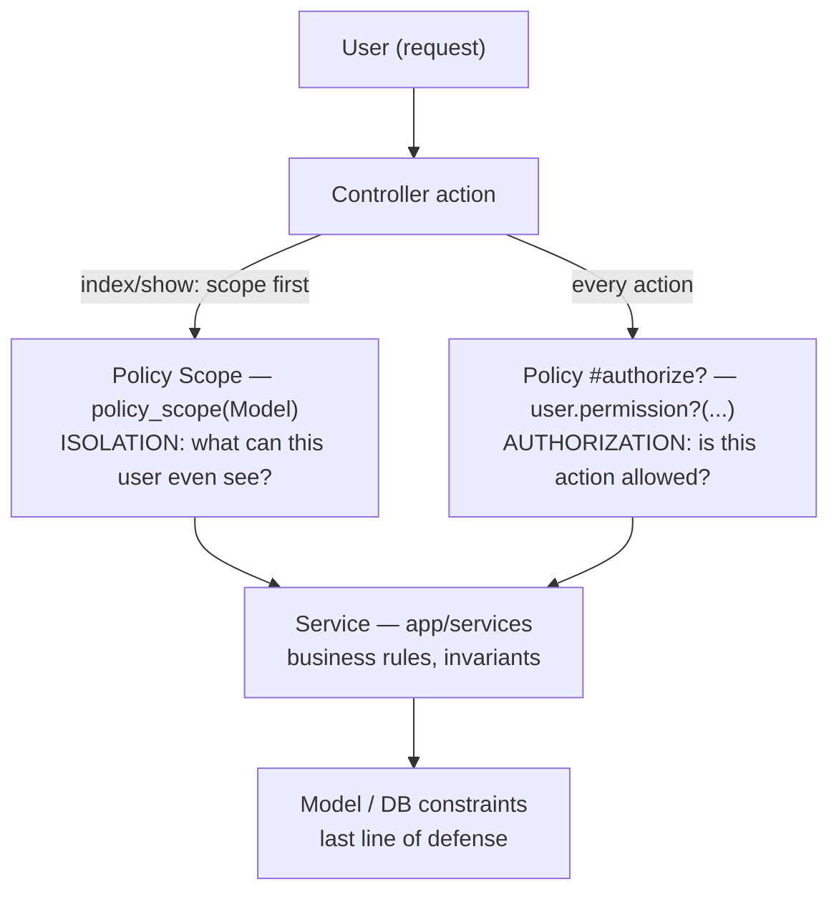
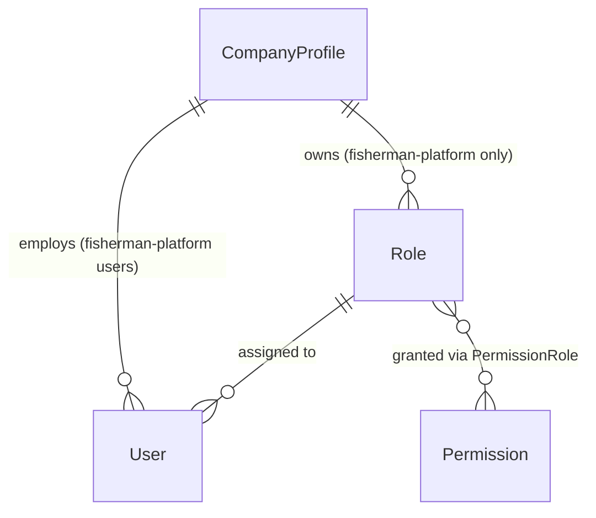
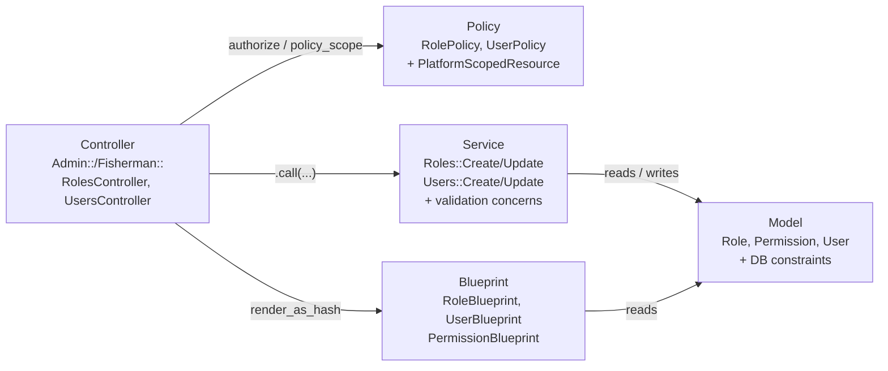
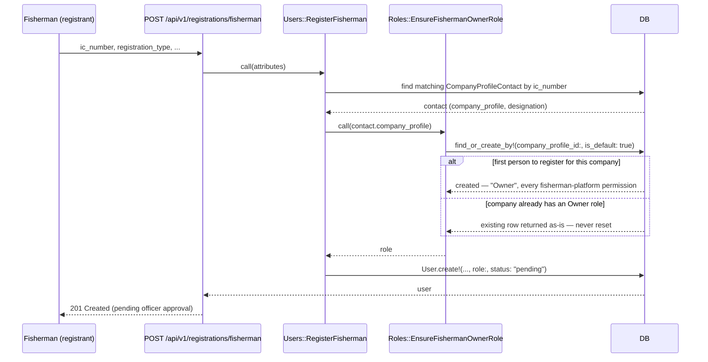
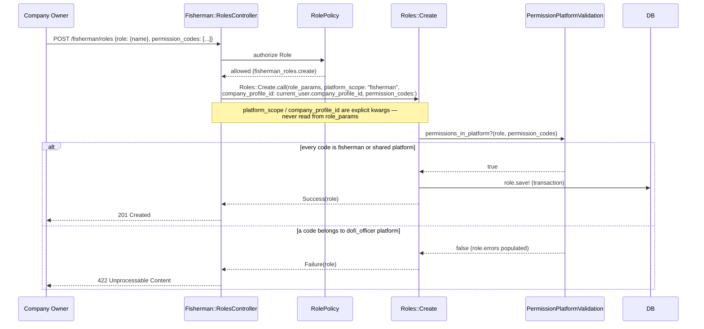
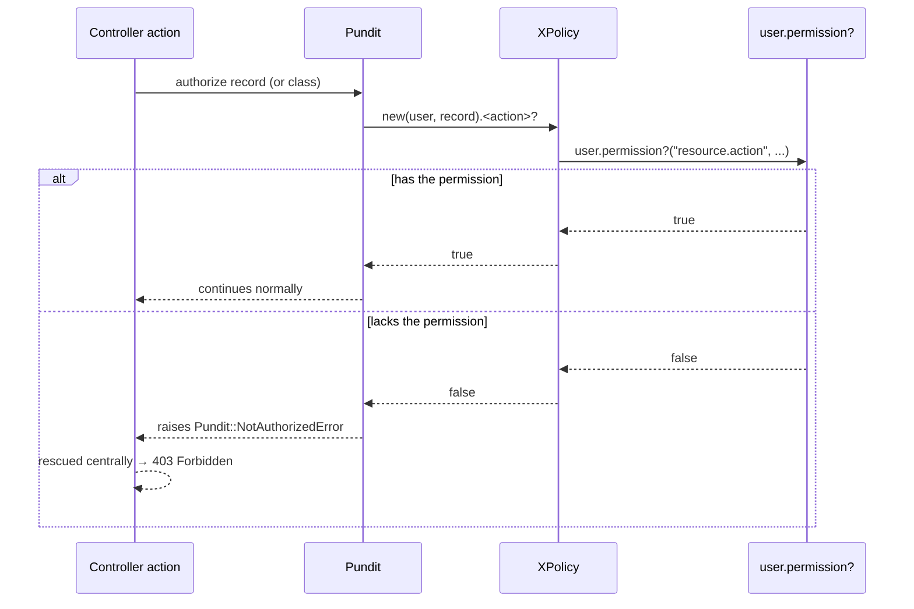
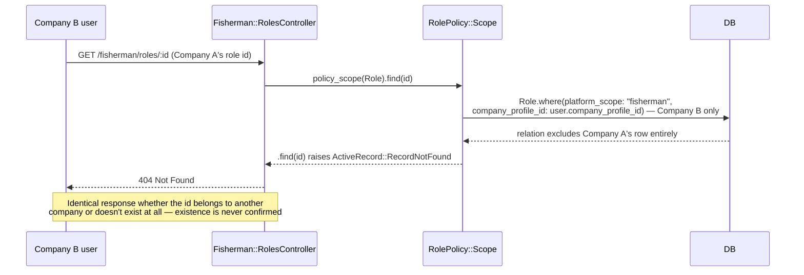
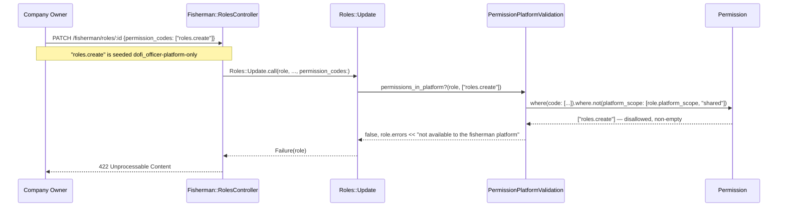

# RBAC: Platform & Company Isolation

How authorization and multi-tenant isolation work across the two platforms this API serves — the
internal DoFi Officer dashboard and the external Fisherman company PWA. Covers the schema, models,
services, policies, controllers, and the invariants that keep one company's data from ever leaking
into another's, plus how to extend the system safely.

Related: [`docs/registration/business-flow.md`](../registration/business-flow.md) §2/§9 for the
incident-driven "why" behind `kind` vs `platform_scope` and the registration-flow angle;
[`docs/ARCHITECTURE.md`](../ARCHITECTURE.md) for how this fits into the app as a whole.

---

## 1. Overview

Every account in this system belongs to one of two **platforms** — `dofi_officer` (the internal
DoFi Officer/Jetty Manager dashboard) or `fisherman` (a fishing company's own PWA). A role's
`platform_scope` says which platform it belongs to; a fisherman-platform role additionally belongs to
exactly one company (`company_profile_id`). This isolation is enforced at the database, service, and
policy layers — not just hidden in the UI — so a company can never see, list, or act on another
company's roles or users, and a fisherman-platform role can never be handed a DoFi-Officer-only
permission.

**Before this existed**: every self-registered fisherman shared one single global `Role` row
(`kind: "Fisherman"`). There was no per-company role or user management at all — a company couldn't
have its own "Owner" managing teammates with different permissions, and there was no way to scope
*anything* fisherman-side to one company versus another. This feature replaced that single global row
with a company-scoped model: every company gets its own auto-created "Owner" role on first
registration, and can create further custom roles for its teammates.

### RBAC scope model



### Authorization vs isolation pipeline

Every request passes through two conceptually different checks — this diagram is the anchor for
§2.5 below, which explains why they're different questions with different failure modes (403 vs 404).



---

## 2. Core concepts

### 2.1 Platform (`platform_scope`)

`Role::PLATFORM_SCOPES = %w[dofi_officer fisherman]` — every role has exactly one. `Permission`
carries a third value, `shared`, for permission codes usable by both platforms (e.g.
`companies_crews.create`, checked identically whether a fisherman is editing their own crew or an
officer is profiling on their behalf through the same dual-mounted controller). A role can never be
"shared" — its own platform is never ambiguous, only which permissions it's allowed to hold are. This
is deliberate asymmetry: don't "simplify" `Permission::PLATFORM_SCOPES` to reuse `Role::PLATFORM_SCOPES`.

### 2.2 Company (`company_profile_id`)

Only present on fisherman-platform roles. A DB check constraint enforces the pairing both ways:
`platform_scope: "fisherman"` requires `company_profile_id` present; `platform_scope: "dofi_officer"`
requires it absent. See §6 for the exact constraint.

### 2.3 Role: `kind` vs `platform_scope`

Two columns that both look like "what kind of role is this," answering different questions:

| Column | Nullable? | Scope | Who sets it | Example values |
|---|---|---|---|---|
| `kind` | Yes, globally unique | The 2 fixed singleton admin roles only | `db/seeds/roles.rb` / console only — never client-writable | `"DoFi Officer"`, `"Jetty Manager"` |
| `platform_scope` | No — required on every role | Every role, including the many per-company custom ones | Always server-derived (controller kwarg), never client-writable | `"dofi_officer"`, `"fisherman"` |

There is **no `Role::FISHERMAN` kind** — Fisherman roles are per-company, identified by
`platform_scope: "fisherman"` + `company_profile_id`, not by `kind`. Full incident-driven rationale
(a prior client-writable discriminator column caused a real production bug) lives in
[`business-flow.md` §2/§9](../registration/business-flow.md) — not repeated here.

### 2.4 Permission

Code convention: `"<resource>.<action>"` (`fisherman_roles.create`, `dofi_officer_users.delete`).
`Permission.assignable_to(role_platform_scope)` returns the codes a role on that platform may hold —
its own platform's codes plus `shared` ones. This is the read side of the invariant
`Roles::PermissionPlatformValidation` enforces on write (§4.4).

### 2.5 Authorization vs Isolation

Two different questions, answered by two different Pundit mechanisms, with two different failure
modes:

- **Authorization** — "is this user *allowed* to perform this action?" Answered by
  `authorize record` → the policy's predicate method (`create?`, `update?`, ...) → `user.permission?`.
  Failure mode: **403 Forbidden**. The resource exists and the user can see it's there; they just
  can't act on it.
- **Isolation** — "can this user even *see* this resource at all?" Answered by
  `policy_scope(Model)` → the policy's `Scope#resolve`, which restricts the queryable set before any
  individual-record check happens. Failure mode: **404 Not Found**. A role or user id outside the
  caller's own company isn't "forbidden" — as far as that caller's view of the system goes, it
  doesn't exist.

Conflating these is the classic multi-tenant leak: if cross-company access 403'd instead of 404'd, a
company could still confirm *that a given id exists* on another company, just not act on it. See
§5.4 for the concrete request trace.

---

## 3. Domain model

Scoped to the entities relevant to RBAC — see [`ARCHITECTURE.md` §4](../ARCHITECTURE.md) for the
full ~27-model domain map.



- One `Role` has many `User`s (single-role model — no multi-role assignment).
- `Role` and `Permission` are many-to-many through the `PermissionRole` join table.
- `CompanyProfile` owns zero or more `Role`s — but only ever fisherman-platform ones;
  dofi_officer-platform roles have no `CompanyProfile` at all (`company_profile_id: nil`).
- `CompanyProfile` also directly employs `User`s (redundant with the `Role` relationship in the sense
  that a fisherman user's company is knowable via their role, but `User.company_profile_id` is its own
  column — see `app/models/user.rb` — since a user's company must be resolvable even before/without a
  role in some flows).

---

## 4. Layered architecture

Same five layers as every other feature in this codebase (enforced in
[`CLAUDE.md`](../../CLAUDE.md)), applied to Roles/Users:



### 4.1 Migrations

Schema evolution only — see §10 for the *why*/rollout story behind these, grouped by phase.

| Migration | Change |
|---|---|
| `20260811090100_add_platform_scope_to_permissions` | Add nullable `platform_scope:string` to `permissions` |
| `20260811090101_backfill_platform_scope_on_permissions` | Data migration: classify existing permission rows |
| `20260811090102_add_platform_scope_not_null_to_permissions` | `NOT NULL` on `permissions.platform_scope` |
| `20260811090103_add_platform_scope_check_constraint_to_permissions` | Check constraint: must be `fisherman`/`dofi_officer`/`shared` |
| `20260811090200_add_platform_scope_and_company_profile_to_roles` | Add `platform_scope`, `is_default`, `company_profile_id` to `roles` |
| `20260811090201_add_company_profile_foreign_key_to_roles` | Add FK `roles.company_profile_id → company_profiles` (`validate: false`) |
| `20260811090202_validate_company_profile_foreign_key_on_roles` | Validate that FK (separate step, avoids a long lock) |
| `20260811090203_backfill_platform_scope_on_roles` | Data migration: `platform_scope: "dofi_officer"` for the fixed-kind + custom admin roles |
| `20260811090204_change_roles_name_uniqueness_scope_to_company_profile` | Rescope the unique index on `name` to `(company_profile_id, name)` |
| `20260811090205_migrate_fishermen_to_company_scoped_owner_roles` | Data migration: split the legacy global `kind: "Fisherman"` role into per-company Owner roles |
| `20260811090206_add_platform_scope_not_null_to_roles` | `NOT VALID` check constraints: not-null + allowed values + fisherman↔company_profile pairing |
| `20260811090207_validate_platform_scope_constraints_on_roles` | Validate those constraints, then set the real `NOT NULL` |
| `20260811110000_add_unique_default_role_per_company` | Partial unique index: one `is_default: true` role per company (hardening pass) |

### 4.2 Models

`Role` and `Permission`, relevant excerpts (schema-annotation comments dropped — `db/schema.rb` is
the source of truth for exact columns):

```ruby
class Role < ApplicationRecord
  DOFI_OFFICER = "DoFi Officer".freeze
  JETTY_MANAGER = "Jetty Manager".freeze
  SYSTEM_KINDS = [DOFI_OFFICER, JETTY_MANAGER].freeze

  DOFI_OFFICER_PLATFORM = "dofi_officer".freeze
  FISHERMAN_PLATFORM = "fisherman".freeze
  PLATFORM_SCOPES = [DOFI_OFFICER_PLATFORM, FISHERMAN_PLATFORM].freeze

  belongs_to :company_profile, optional: true
  has_many :permission_roles, dependent: :destroy
  has_many :permissions, through: :permission_roles
  has_many :users, dependent: :nullify

  validates :name, presence: true, uniqueness: { scope: :company_profile_id }
  validates :kind, inclusion: { in: SYSTEM_KINDS }, uniqueness: true, allow_nil: true
  validates :platform_scope, presence: true, inclusion: { in: PLATFORM_SCOPES }
  validates :company_profile_id, presence: true, if: :fisherman_platform?
  validates :company_profile_id, absence: true, unless: :fisherman_platform?

  def fisherman_platform? = platform_scope == FISHERMAN_PLATFORM
  def dofi_officer_platform? = platform_scope == DOFI_OFFICER_PLATFORM
  def external? = kind == JETTY_MANAGER || fisherman_platform?

  def self.external = where(kind: JETTY_MANAGER).or(where(platform_scope: FISHERMAN_PLATFORM))
  def self.assignable_by_admin = where.not(id: external.select(:id))
  def self.assignable_by_fisherman(company_profile_id)
    where(platform_scope: FISHERMAN_PLATFORM, company_profile_id: company_profile_id)
  end
end
```

```ruby
class Permission < ApplicationRecord
  DOFI_OFFICER_PLATFORM = "dofi_officer".freeze
  FISHERMAN_PLATFORM = "fisherman".freeze
  SHARED_PLATFORM = "shared".freeze
  PLATFORM_SCOPES = [DOFI_OFFICER_PLATFORM, FISHERMAN_PLATFORM, SHARED_PLATFORM].freeze

  has_many :permission_roles, dependent: :destroy
  has_many :roles, through: :permission_roles

  validates :name, presence: true
  validates :code, presence: true, uniqueness: true
  validates :platform_scope, presence: true, inclusion: { in: PLATFORM_SCOPES }

  def self.assignable_to(role_platform_scope) = where(platform_scope: [role_platform_scope, SHARED_PLATFORM])
end
```

Full source: [`app/models/role.rb`](../../app/models/role.rb),
[`app/models/permission.rb`](../../app/models/permission.rb).

### 4.3 Seeds

`db/seeds/permissions.rb` defines every permission code in one `PERMISSION_GROUPS` hash
(`"resource" => %w[view list create update delete]`-shaped), then classifies each into a platform via
`platform_scope_for` — everything defaults to `shared` unless explicitly listed as
DoFi-Officer-only or Fisherman-only (whole resource group, or specific actions within one):

```ruby
def platform_scope_for(resource, action)
  return Permission::FISHERMAN_PLATFORM if FISHERMAN_ONLY_GROUPS.include?(resource)
  return Permission::DOFI_OFFICER_PLATFORM if DOFI_OFFICER_ONLY_GROUPS.include?(resource)
  return Permission::DOFI_OFFICER_PLATFORM if DOFI_OFFICER_ONLY_ACTIONS[resource]&.include?(action)

  Permission::SHARED_PLATFORM
end
```

`db/seeds/roles.rb` seeds only the 2 fixed `kind` roles (DoFi Officer gets every permission, Jetty
Manager gets a fixed list) — **there is no Fisherman entry**, since per-company Owner roles are
created on demand by `Roles::EnsureFishermanOwnerRole` (§4.4), not seeded up front. Both seed files
are idempotent (`find_or_create_by!` + drift-correcting `update!`), safe to rerun.

Full source: [`db/seeds/permissions.rb`](../../db/seeds/permissions.rb),
[`db/seeds/roles.rb`](../../db/seeds/roles.rb).

### 4.4 Services

Three small, single-purpose modules do all the actual invariant enforcement — shown in full because
each one *is* the invariant, not incidental plumbing around it:

```ruby
module Roles
  # Idempotent: the first person to register for a company creates it; everyone after reuses the
  # same row. Keyed on (company_profile_id, is_default) rather than name, so a company renaming
  # their Owner role can't cause a second "default" role to be silently created.
  class EnsureFishermanOwnerRole
    def self.call(...) = new.call(...)

    def call(company_profile)
      Role.find_or_create_by!(company_profile_id: company_profile.id, is_default: true) do |role|
        role.name = "Owner"
        role.description = "Full access to this company's fisherman-platform data."
        role.platform_scope = Role::FISHERMAN_PLATFORM
        role.permissions = Permission.assignable_to(Role::FISHERMAN_PLATFORM)
      end
    end
  end
end
```

```ruby
module Roles
  # Shared by Roles::Create/Update — the one place that enforces "a role can only be assigned
  # permission codes belonging to its own platform, or shared codes."
  module PermissionPlatformValidation
    private

    def permissions_in_platform?(role, permission_codes)
      return true if permission_codes.blank?
      return false unless all_codes_exist?(role, permission_codes.map(&:to_s))

      no_cross_platform_codes?(role, permission_codes)
    end

    def no_cross_platform_codes?(role, permission_codes)
      allowed_scopes = [role.platform_scope, Permission::SHARED_PLATFORM]
      disallowed = Permission.where(code: permission_codes).where.not(platform_scope: allowed_scopes).pluck(:code)
      return true if disallowed.empty?

      role.errors.add(:permission_codes,
                      "includes codes not available to the #{role.platform_scope} platform: " \
                      "#{disallowed.join(', ')}")
      false
    end
    # all_codes_exist? omitted here — rejects unknown codes the same way; see source.
  end
end
```

```ruby
module Users
  # Shared by Users::Create/Update — the one place that enforces "a user can only be assigned a
  # role from the roles available to the acting context." Doesn't know or care which platform
  # called it, only whether the requested role_id is in the set it was handed.
  module RoleAssignmentValidation
    private

    def role_assignable?(user, role_id, assignable_roles, require_role: false)
      if role_id.blank?
        return true unless require_role

        user.errors.add(:role_id, "can't be blank")
        return false
      end
      return true if assignable_roles.exists?(id: role_id)

      user.errors.add(:role_id, "is not a role available to you")
      false
    end
  end
end
```

`Roles::Create`/`Update` and `Users::Create`/`Update` are thin wrappers around these — the part worth
seeing is that `platform_scope`/`company_profile_id` are **forced keyword arguments**, never read
from the attributes hash, and persistence is transaction-wrapped:

```ruby
# app/services/roles/create.rb — signature + the invariant-bearing lines
def call(attributes, platform_scope:, permission_codes: nil, company_profile_id: nil)
  role = Role.new(attributes.merge(platform_scope:, company_profile_id:))
  return Failure(role) unless permissions_in_platform?(role, permission_codes)

  ActiveRecord::Base.transaction do
    role.save!
    role.permissions = Permission.where(code: permission_codes) if permission_codes
  end
  Success(role)
rescue ActiveRecord::RecordInvalid
  Failure(role)
end
```

Full source: [`app/services/roles/ensure_fisherman_owner_role.rb`](../../app/services/roles/ensure_fisherman_owner_role.rb),
[`app/services/roles/permission_platform_validation.rb`](../../app/services/roles/permission_platform_validation.rb),
[`app/services/users/role_assignment_validation.rb`](../../app/services/users/role_assignment_validation.rb),
[`app/services/roles/create.rb`](../../app/services/roles/create.rb),
[`app/services/roles/update.rb`](../../app/services/roles/update.rb),
[`app/services/users/create.rb`](../../app/services/users/create.rb),
[`app/services/users/update.rb`](../../app/services/users/update.rb).

### 4.5 Policies

`PlatformScopedResource` — included by `RolePolicy`/`UserPolicy`/`PermissionPolicy`, shown in full
(12 lines): picks which permission-code resource name to check, based on the *acting user's* platform,
not the record's:

```ruby
module PlatformScopedResource
  extend ActiveSupport::Concern

  private

  def resource
    user.dofi_officer_platform? ? self.class::RESOURCE : self.class::FISHERMAN_RESOURCE
  end
end
```

`ApplicationPolicy` (base contract every policy honors — Liskov): all predicates deny by default,
`Scope#resolve` must be overridden:

```ruby
def index? = false
def show? = false
def create? = false
def update? = false
def destroy? = false
# Scope#resolve raises NoMethodError unless overridden
```

`RolePolicy`/`UserPolicy` — the isolation-critical methods only (`owns_record?` and `Scope#resolve`;
the `index?`/`show?`/etc. predicates are formulaic `user.permission?(...)` one-liners, omitted here):

```ruby
# RolePolicy
def owns_record?
  return true if user.dofi_officer_platform?

  record.platform_scope == Role::FISHERMAN_PLATFORM && record.company_profile_id == user.company_profile_id
end

class Scope < Scope
  def resolve
    return scope.where(platform_scope: Role::DOFI_OFFICER_PLATFORM) if user.dofi_officer_platform?
    return scope.where(platform_scope: Role::FISHERMAN_PLATFORM,
                       company_profile_id: user.company_profile_id) if user.fisherman?

    scope.none
  end
end
```

`UserPolicy#owns_record?`/`Scope#resolve` follow the identical shape, scoped on
`company_profile_id` directly instead of via `platform_scope`.

Full source: [`app/policies/concerns/platform_scoped_resource.rb`](../../app/policies/concerns/platform_scoped_resource.rb),
[`app/policies/application_policy.rb`](../../app/policies/application_policy.rb),
[`app/policies/role_policy.rb`](../../app/policies/role_policy.rb),
[`app/policies/user_policy.rb`](../../app/policies/user_policy.rb).

### 4.6 Controllers

`Fisherman::RolesController` shown in full — the one place the whole server-derivation pattern is
visible end to end:

```ruby
module Api
  module V1
    module Fisherman
      class RolesController < ApplicationController
        include RansackSearchable

        before_action :set_role, only: %i[show update destroy]

        def index
          authorize Role
          result = apply_ransack_search(policy_scope(Role), default_sort: "name asc")
          pagy, records = pagy(:offset, result)
          render json: { status: "success", data: RoleBlueprint.render_as_hash(records), meta: pagination_meta(pagy) }
        end

        def create
          authorize Role

          result = Roles::Create.call(role_params, platform_scope: Role::FISHERMAN_PLATFORM,
                                                   company_profile_id: current_user.company_profile_id,
                                                   permission_codes: params[:permission_codes])
          case result
          in Success(role)
            render json: { status: "success", data: RoleBlueprint.render_as_hash(role) }, status: :created
          in Failure(role)
            render json: { status: "fail", errors: role.errors.full_messages }, status: :unprocessable_content
          end
        end

        private

        # policy_scope, not a raw Role.find — another company's role 404s via RecordNotFound
        # rather than 403ing and confirming the id exists (§2.5, §5.4).
        def set_role
          @role = policy_scope(Role).find(params.expect(:id))
        end

        # kind/platform_scope/company_profile_id are never in this allowlist.
        def role_params
          params.expect(role: %i[name description])
        end
      end
    end
  end
end
```

(`show`/`update`/`destroy` follow the same `authorize @role` → service/render pattern as `create`;
omitted here for length — see source.)

`Admin::RolesController`/`UsersController` and `Fisherman::UsersController` are structurally
identical — same `RansackSearchable`, same `pagy`/blueprint rendering, same `Success`/`Failure`
pattern match, same `policy_scope(...).find`. The only difference is which ownership context gets
forced into the service call:

```ruby
# Admin::RolesController#create
Roles::Create.call(role_params, platform_scope: Role::DOFI_OFFICER_PLATFORM,
                                permission_codes: params[:permission_codes])

# Fisherman::RolesController#create
Roles::Create.call(role_params, platform_scope: Role::FISHERMAN_PLATFORM,
                                company_profile_id: current_user.company_profile_id,
                                permission_codes: params[:permission_codes])

# Admin::UsersController#create
Users::Create.call(user_params, assignable_roles: Role.assignable_by_admin)

# Fisherman::UsersController#create
Users::Create.call(create_params, assignable_roles: Role.assignable_by_fisherman(current_user.company_profile_id))
```

One asymmetry worth knowing: `Admin::UsersController#destroy` soft-deletes (`@user.discard`, via the
`discard` gem), matching `Fisherman::UsersController#destroy`; `RolesController#destroy` on both
sides hard-deletes (`@role.destroy`) — roles aren't audited/discardable records.

Full source: [`app/controllers/api/v1/fisherman/roles_controller.rb`](../../app/controllers/api/v1/fisherman/roles_controller.rb),
[`app/controllers/api/v1/fisherman/users_controller.rb`](../../app/controllers/api/v1/fisherman/users_controller.rb),
[`app/controllers/api/v1/admin/roles_controller.rb`](../../app/controllers/api/v1/admin/roles_controller.rb),
[`app/controllers/api/v1/admin/users_controller.rb`](../../app/controllers/api/v1/admin/users_controller.rb).

### 4.7 Blueprints

All three are tiny — response shaping only, no business logic:

```ruby
class RoleBlueprint < Blueprinter::Base
  identifier :id
  fields :kind, :name, :description, :platform_scope, :company_profile_id, :is_default, :created_at, :updated_at
  association :permissions, blueprint: PermissionBlueprint
end

class PermissionBlueprint < Blueprinter::Base
  identifier :id
  fields :code, :name, :platform_scope
end

class UserBlueprint < Blueprinter::Base
  identifier :id
  fields :name, :email, :employee_id, :username, :status, :preferred_locale, :unit, :position,
         :contact_no, :designation, :registration_type, :rejection_reason, :created_at, :updated_at
  association :role, blueprint: RoleBlueprint
  association :company_profile, blueprint: CompanyProfileBlueprint
end
```

`platform_scope`/`company_profile_id`/`is_default` are rendered so clients can display them, but note
this is read-only exposure — none of these fields are ever accepted back in on write (§4.6).

Full source: [`app/blueprints/role_blueprint.rb`](../../app/blueprints/role_blueprint.rb),
[`app/blueprints/permission_blueprint.rb`](../../app/blueprints/permission_blueprint.rb),
[`app/blueprints/user_blueprint.rb`](../../app/blueprints/user_blueprint.rb).

### 4.8 Routes

```ruby
namespace :admin, defaults: { audience: "admin" } do
  resources :users, only: %i[index show create update destroy]
  resources :roles, only: %i[index show create update destroy]
  # ...
end

namespace :fisherman, defaults: { audience: "fisherman" } do
  resources :users, only: %i[index show create update destroy]
  resources :roles, only: %i[index show create update destroy]
  # ...
end
```

Plain REST resources on both sides — no member/collection routes beyond the standard 5 actions.
`defaults: { audience: "admin"/"fisherman" }` feeds `RequireAudience`
(`app/controllers/concerns/require_audience.rb`), a coarse pre-filter in front of Pundit's own
per-action checks (wrong-audience access is a flat 403, independent of permissions).

Full source: [`config/routes.rb`](../../config/routes.rb).

---

## 5. Request flows

### 5.1 Fisherman self-registration → Owner role created or reused



### 5.2 A company creates a custom role



### 5.3 Generic authorization check



### 5.4 Cross-company access → 404, never 403



### 5.5 Cross-platform permission assignment → 422



---

## 6. Security invariants & isolation guarantees

Rules that must never be violated — the part meant to outlive any individual reader's memory of how
the code works. Each row names the actual enforcement mechanism, not just the intent, since a
mechanism can be checked/tested and an intent can't.

| Invariant | Enforced by | Layer |
|---|---|---|
| A fisherman-platform role belongs to exactly one company | `validates :company_profile_id, presence: true, if: :fisherman_platform?` + a cross-column DB check constraint (`platform_scope='fisherman'` requires `company_profile_id` present, `'dofi_officer'` requires it absent) | Model + Database |
| A fisherman role is only visible within its own company | `RolePolicy::Scope`/`UserPolicy::Scope` — the fisherman branch scopes to `user.company_profile_id` | Policy (Scope) |
| A fisherman role can never hold a dofi_officer-only permission | `Roles::PermissionPlatformValidation#no_cross_platform_codes?` | Service |
| Client cannot choose `platform_scope` on create/update | Controller passes it as an explicit keyword argument; `role_params` never permits it | Controller |
| Client cannot choose `company_profile_id` on create/update | Same — explicit keyword argument, never in `role_params` | Controller |
| A user can only be assigned a role from their own assignable set | `Users::RoleAssignmentValidation#role_assignable?` against `Role.assignable_by_admin` / `assignable_by_fisherman(company_profile_id)` | Service |
| Exactly one `is_default: true` Owner role per company | Partial unique index — `add_index :roles, :company_profile_id, unique: true, where: "is_default = true"` (`db/migrate/20260811110000_add_unique_default_role_per_company.rb`) | Database |
| The default Owner role can never be deleted | `RolePolicy#destroy?` includes `&& !record.is_default?` | Policy |
| Reaching for another company's role/user by id never confirms it exists | `policy_scope(...).find` raises `RecordNotFound` (404), not `Pundit::NotAuthorizedError` (403) | Controller + Policy |
| Role creation/update is atomic — never a saved role with a dropped permission set | `Roles::Create`/`Update` wrap `role.save!` + permission assignment in `ActiveRecord::Base.transaction` | Service |

---

## 7. Business flow — actors & permissions

Focused on *post-registration* role/user management — the self-registration flow itself (how an
account first comes to exist) is documented in
[`business-flow.md` §1/§5](../registration/business-flow.md), not repeated here.

### 7.1 DoFi Officer

`platform_scope: "dofi_officer"`, `kind: "DoFi Officer"`. Manages `admin/roles` (any dofi_officer-
platform role) and `admin/users` (any internal officer account). Cannot see or touch **any** company's
fisherman-platform roles or users — `RolePolicy::Scope`/`UserPolicy::Scope` return `scope.none` for
a dofi_officer-platform user requesting a resource that isn't theirs to see, and there's no admin
endpoint that even queries fisherman-platform rows.

### 7.2 Company Owner

The user holding a company's `is_default: true` "Owner" role (auto-created on first registration,
§5.1). By default holds every fisherman-platform permission — including `fisherman_roles.*` and
`fisherman_users.*` — so they can create custom roles for their company and invite/manage teammates,
all transparently scoped to their own `company_profile_id` server-side. Cannot reach another
company's roles/users (404, §5.4) and cannot reach any dofi_officer-platform resource
(403 via `RequireAudience` before Pundit is even consulted).

### 7.3 Company Teammate

A user assigned to one of the company's *custom* (non-default) roles by the Owner (or another
teammate who holds `fisherman_users.update`). Their permissions are exactly whatever that custom role
was granted — anywhere from full `fisherman_roles`/`fisherman_users` access down to zero permissions
(a role created with no `permission_codes` is valid and the existing behavior, not a bug). Same
company-isolation guarantees apply regardless of how few permissions they hold.

---

## 8. Libraries & dependencies

| Gem | Version | Role in this feature |
|---|---|---|
| `pundit` | 2.5.2 | Authorization (`authorize`) and isolation (`policy_scope`) — the two mechanisms in §2.5 |
| `dry-monads` | ~> 1.9 (1.10.0) | `Success`/`Failure` results from every service — controllers pattern-match instead of rescuing exceptions |
| `blueprinter` | 1.3.0 | Response shaping (`RoleBlueprint`, `PermissionBlueprint`, `UserBlueprint`) |
| `ransack` | 4.4.1 | Search/filter on `index` (e.g. `q[name_cont]`, `q[kind_eq]`) |
| `pagy` | 43.5.6 | Pagination on `index` |
| `strong_migrations` | 2.8.0 | Forces `safety_assured`/`disable_ddl_transaction!`/`algorithm: :concurrently` awareness on the schema migrations in §4.1/§10 |
| `devise` + `devise-jwt` | 5.0.4 / 0.13.0 | The underlying authentication (JWT sessions) this authorization layer sits on top of — not RBAC itself, but `current_user` wouldn't exist without it |
| `discard` | ~> 1.4 (1.4.0) | Soft-delete on `User#destroy` (both admin and fisherman sides) |

---

## 9. Extending the RBAC system

### 9.1 Adding a permission

1. Add it to `PERMISSION_GROUPS` in `db/seeds/permissions.rb` — `"resource" => %w[action1 action2]`.
2. Classify its platform: whole resource → `DOFI_OFFICER_ONLY_GROUPS`/`FISHERMAN_ONLY_GROUPS`;
   specific actions only → `DOFI_OFFICER_ONLY_ACTIONS`; otherwise it defaults to `shared`.
3. Run `bin/rails db:seed` — idempotent (`find_or_create_by!` + a drift-correcting `update!`).
4. Attach it to relevant roles: for the 2 system roles, add the code to `db/seeds/roles.rb`'s
   `ROLE_DEFINITIONS`; a company's Owner role picks it up automatically if it's fisherman/shared
   (§4.4's `Permission.assignable_to`), otherwise a company attaches it manually via
   `PATCH /fisherman/roles/:id`.
5. Reference the code in the relevant policy predicate: `def action? = user.permission?("resource.action")`.
6. Add a test asserting the permission gates the action, and — if platform-restricted — that the
   wrong platform is rejected (see `test/controllers/api/v1/*/roles_controller_test.rb`'s
   `"create rejects a permission code belonging to the ... platform"` tests for the pattern).

### 9.2 Adding a role type

Most new "roles" are really new *permission combinations* on the existing per-company Owner/custom
role mechanism — only follow this if you need a genuinely new fixed singleton (like adding a third
`kind`) or a new *kind* of scoping altogether:

1. Add a `kind` constant to `Role::SYSTEM_KINDS` only if code needs to key off it specifically
   (like `User#officer?`) — most new roles don't need this.
2. Decide ownership: company-scoped (`platform_scope: "fisherman"`, needs `company_profile_id`) or
   global (`platform_scope: "dofi_officer"`, `company_profile_id` must stay nil)?
3. Decide assignability — should `Role.assignable_by_admin`/`assignable_by_fisherman` include or
   exclude it? Governed by `external?`.
4. Decide default behavior — does every company/context need one automatically (mirror
   `EnsureFishermanOwnerRole`), or is it always explicit?
5. If it's a new fixed singleton, add the DB invariant mirroring `roles.kind`'s existing uniqueness.
6. Seed it, test the policy/service coverage for the new kind.

### 9.3 Adding a new platform

1. Add the constant to both `Role::PLATFORM_SCOPES` and `Permission::PLATFORM_SCOPES`.
2. Decide and seed its allowed permissions (extend the `PERMISSION_GROUPS` classification in §4.3).
3. Add a branch to every `Policy::Scope#resolve` that currently only handles
   `dofi_officer_platform?`/`fisherman?` — `RolePolicy::Scope`, `UserPolicy::Scope`, and any other
   `PlatformScopedResource`-including policy.
4. Decide role-creation rules for it (per-tenant like fisherman, or global like dofi_officer) and
   extend `Roles::Create`/`Update`'s callers accordingly.
5. Extend `db/seeds/roles.rb`/`permissions.rb` for the new platform's seed data.
6. Add security tests mirroring the fisherman controller tests — permission-layer and scope-layer
   kept as **separate** tests, each isolating one authorization layer (see §11).
7. Add Postman coverage — a new folder mirroring `Roles / Fisherman`, `Users / Fisherman` (§11).

### 9.4 Changing company scoping

If the tenant boundary itself needs to change (e.g. sharing a role across multiple companies, or
scoping by something other than `CompanyProfile`):

1. The FK/column itself (`roles.company_profile_id`) and its NOT NULL / check constraints.
2. `RolePolicy::Scope#fisherman_scope` / `UserPolicy::Scope#fisherman_scope` — the isolation boundary.
3. `Role.assignable_by_fisherman` — the assignability boundary.
4. A data migration for existing rows — `20260811090205_migrate_fishermen_to_company_scoped_owner_roles.rb`
   (§10 Phase 2) is the template for this exact shape of cutover.
5. The partial unique index (§6) if the "one default role per X" invariant's `X` changes.
6. Test and Postman coverage for the new scoping boundary.

---

## 10. Migration & rollout history

The *why*/story behind §4.1's migrations — grouped by phase, not repeating each migration's purpose
again.

**Phase 1 — Introduce platform isolation.** `Permission` gets `platform_scope` first (add column →
backfill → not-null → check constraint), then `Role` gets `platform_scope` + `is_default` +
`company_profile_id` the same way, plus the FK and the rescoped name-uniqueness index. At the end of
this phase every *existing* role is correctly classified, but the single legacy `kind: "Fisherman"`
row is still one global row shared by every company.

**Phase 2 — Migrate existing fisherman roles.** One data migration
(`migrate_fishermen_to_company_scoped_owner_roles`) does the actual cutover: for every distinct
company among the legacy role's users, create a new per-company `"Owner"` role cloning its
permissions, reassign that company's users to it, then destroy the legacy row. This is the last
migration that could still address the legacy role by `kind` — the very next one makes
`platform_scope` mandatory.

**Phase 3 — Introduce company ownership as a hard invariant.** The `NOT VALID` check constraints go
on (not-null, allowed values, and the fisherman-requires-company/dofi_officer-requires-no-company
pairing), then get validated and the column-level `NOT NULL` lands. From this point the pairing is a
database guarantee, not just application logic.

**Phase 4 — Harden uniqueness and transaction boundaries.** A follow-up pass, after an external
review: `Roles::Create`/`Update` were wrapped in `ActiveRecord::Base.transaction` (§6's atomicity
row); a partial unique index closed the gap where nothing previously stopped two *differently-named*
roles both being `is_default: true` for one company — preceded by a pre-flight duplicate check against
real data and an in-migration defensive dedupe, not a blind index add; and two targeted security tests
were added, deliberately kept **separate**, to prove the permission-check layer (403) and the
role-assignment-scope layer (422) are independently covered rather than conflated into one test that
wouldn't reveal which layer regressed.

---

## 11. Testing & verification

**Automated tests** (`bin/rails test`, 376/376 passing):
- `test/controllers/api/v1/admin/roles_controller_test.rb`,
  `test/controllers/api/v1/fisherman/roles_controller_test.rb` — CRUD, ransack search, cross-platform
  permission rejection, mass-assignment injection (`platform_scope`/`company_profile_id` actively sent
  and ignored).
- `test/controllers/api/v1/admin/users_controller_role_restriction_test.rb`,
  `users_controller_scoping_test.rb`, `test/controllers/api/v1/fisherman/users_controller_test.rb` —
  role-assignment scoping, cross-company 404s, the split permission-layer (403) vs
  role-assignment-scope-layer (422) self-reassignment tests from §10 Phase 4.
- `test/services/roles/` — `EnsureFishermanOwnerRole` idempotency.

**Postman** (`postman/DoFi-Backend.postman_collection.json`) — `Roles / Fisherman` and
`Users / Fisherman` subfolders (nested inside the existing `Roles`/`Users` folders), covering
index/show/create/update/destroy plus live rejection examples (cross-company 404, cross-platform
permission 422, foreign role_id 422). Verified via:
```
npx newman run postman/DoFi-Backend.postman_collection.json \
  -e postman/DoFi-Backend-Local.postman_environment.json \
  --folder "Auth" --folder "Roles" --folder "Users"
```

**CI checks**: `bin/rubocop` (0 offenses), `bin/brakeman` (0 warnings), `bin/bundler-audit`
(0 vulnerabilities) — `bin/ci` runs the full set.

---

## 12. Known limitations / deliberately deferred

- **Company lifecycle cascading** (suspend/archive/merge → role/user deactivation) — a real future
  question, but a *company lifecycle* feature, not part of RBAC isolation itself.
  `has_many :roles, dependent: :restrict_with_error` already prevents the dangerous case (hard-deleting
  a company that still has roles).
- **Audit logging for RBAC changes** — the `audited` gem is in the `Gemfile` but `Audited::Auditable`
  is on zero models today; adding it to `Role` alone with no read endpoint would be a half-finished
  feature, not a hardening.
- **Permission caching** — `user.permission?` is a simple indexed `exists?` query; no measured
  performance problem motivates this yet.
- **No separate "authorization matrix" document** — superseded by §6 above. A parallel prose
  document restating the same invariants would need separate upkeep and could go stale silently,
  which is worse than not having it; §6's mechanisms are checked/tested code, not prose.

---

## 13. Where to go deeper

- [`docs/registration/business-flow.md`](../registration/business-flow.md) — actors, registration &
  approval lifecycle, and the `kind`/`platform_scope` incident narrative (§2/§9)
- [`docs/ARCHITECTURE.md`](../ARCHITECTURE.md) — how this feature fits into the app as a whole
- [`CLAUDE.md`](../../CLAUDE.md) — the layering/SOLID rules this doc's diagrams illustrate
- `test/controllers/api/v1/admin/roles_controller_test.rb`,
  `test/controllers/api/v1/fisherman/roles_controller_test.rb`, and their `users_controller_test.rb`
  counterparts — the executable specification
- `postman/DoFi-Backend.postman_collection.json` — `Roles`/`Users` folders (both `Admin` and nested
  `Fisherman` subfolders)
