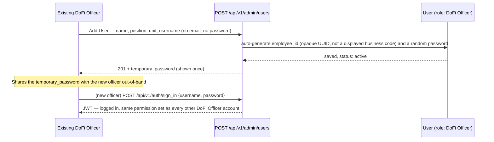
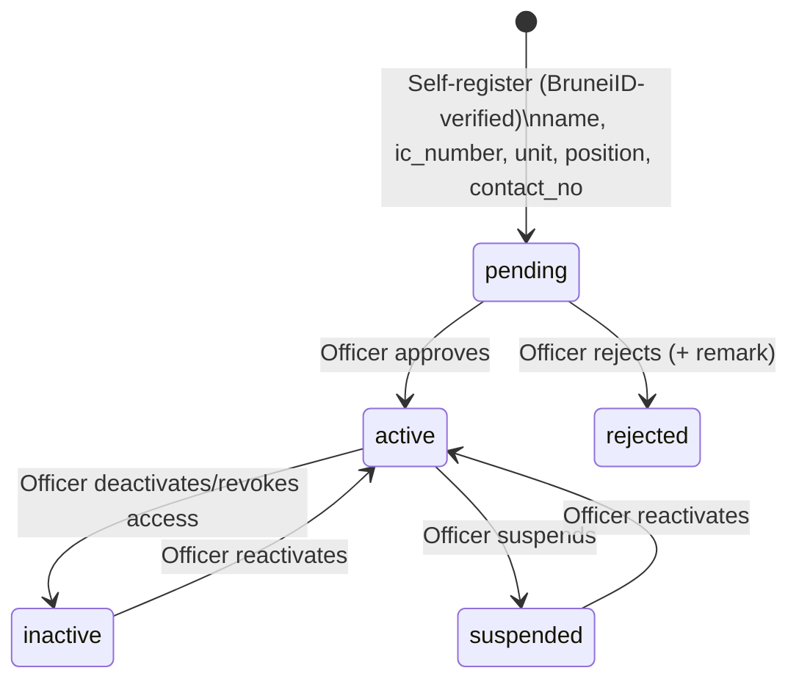
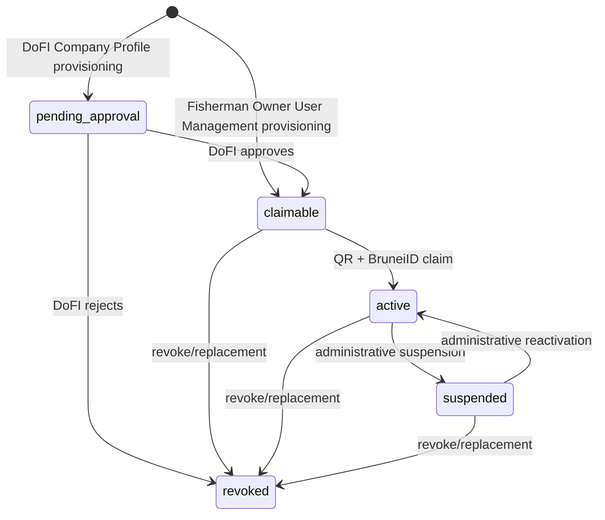
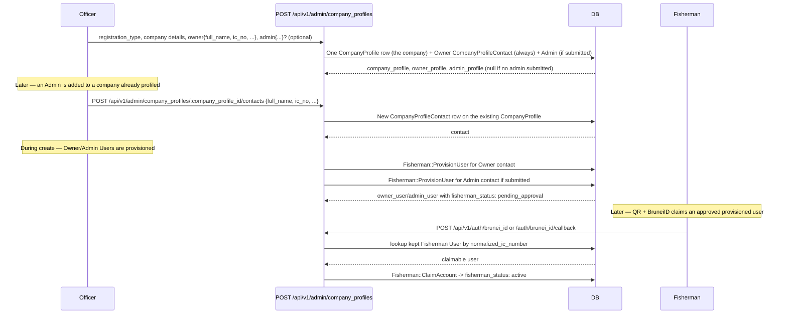

# Business Flow — Actors, Roles & Lifecycles

This is the business-level companion to [`registration-flow.md`](registration-flow.md) (endpoint
request/response contracts) and [`testing-mock-brunei-id-login.md`](testing-mock-brunei-id-login.md)
(how to exercise it). This doc answers a different question: **who are the actors, how does each one
get an account, who approves what, and why were the non-obvious decisions made this way.**

---

## 1. The three actors

| Actor | Role | How they get an account | How they log in |
|---|---|---|---|
| **DoFi Officer / Administrator** | `kind: "DoFi Officer"` | Created by another officer via **User Management → Add User** (internal, authenticated) | `username` + password (real credential check) |
| **Jetty Manager** | `kind: "Jetty Manager"` | Self-registers via the public registration form (BruneiID-verified) | BruneiID QR re-scan (mocked today) |
| **Fisherman** | `platform_scope: "fisherman"` — company-scoped Owner/Admin/custom roles (see §2) | Provisioned before first login by DoFI Company Profiling or Fisherman Owner User Management | BruneiID QR claim/login (mocked today) |

**The one thing that explains most of this system's design**: officers are an *internal, trusted*
population managed by other officers, so they get a real credential (`username`/password) chosen by
the system, no external identity check. Jetty Managers remain an external QR-first population that
can self-register when no account exists. Fishermen are also BruneiID-authenticated, but they are no
longer self-service for account creation: a Fisherman `User` must already be provisioned before the
first QR scan can claim/login. Every other decision below (no email requirement, no manual
passwords, separate lifecycle fields, and no Fisherman registration fallback) follows from this
split.

---

## 2. Roles & Permissions model

For the full architecture behind this — migrations, services, policies, diagrams, security
invariants, and how to extend it — see
[`docs/rbac/platform-company-isolation.md`](../rbac/platform-company-isolation.md). This section
stays focused on what a new registrant needs to know; that doc is the canonical deep reference.

```
Role (e.g. "DoFi Officer") ──has many──> Permission (e.g. "dofi_officer_users.create")
```

- One `User` belongs to exactly one `Role` (single-role model — no multi-role assignment).
- A `Permission` is identified by a `code` string, conventionally `"<resource>.<action>"`
  (`dofi_officer_users.create`, `fisherman_approvals.approve`, `positions.list`, ...).
- Every controller action calls `user.permission?(*codes)` (via a Pundit policy) — true if the
  user's role has *any* of the listed permission codes.
- **"Administrator" is not a separate role.** All DoFi Officer/Administrator accounts share the
  same DoFi Officer role and the same permission set (today: full access). "Administrator" vs.
  "DoFi Officer" is a **Position** (a master-data job title, see §9) purely for display — it does
  not change what the account can do. If a genuinely lower-privilege internal role is ever needed
  (e.g. a read-only officer), that's a *new* `Role` row with its own permission set, not a
  conditional on the existing one (Open/Closed — see CLAUDE.md).
- `Role`/`Permission`/`Users::Create` intentionally have no concept of "this role needs X field" —
  that logic lives on `User` itself (`officer?`/`jetty_manager?`/`fisherman?` predicates gate
  presence validations). Roles are just a name + a permission set; they don't carry business rules.

### `kind` vs `platform_scope` — two deliberately separate discriminators

`Role` carries two different columns that both look like "what kind of role is this," and they
answer different questions on purpose:

- **`kind`** (nullable, globally unique) identifies the small, *fixed* set of canonical singleton
  roles: `Role::DOFI_OFFICER` / `Role::JETTY_MANAGER` (`Role::SYSTEM_KINDS`) — exactly one row each,
  seeded once via `db/seeds/roles.rb`, never created through the API. **`kind` is never accepted by
  `RolesController#role_params`** on either the admin or fisherman controller. `User#officer?/
  jetty_manager?`, the approval policies' scopes, and which role `Users::RegisterJettyManager`
  assigns all key off `kind` — see §9 for why this is a dedicated column rather than reusing a
  display code.
- **`platform_scope`** (`Role::DOFI_OFFICER_PLATFORM`/`FISHERMAN_PLATFORM`, required on every role —
  `Role::PLATFORM_SCOPES`) identifies which platform a role belongs to — not just the 2 fixed `kind`
  rows, but *every* role, including the many per-company Fisherman roles below. A role can have a
  `platform_scope` without a `kind` (every custom role does); it can never have neither.
- `Permission#platform_scope` adds a third value, `Permission::SHARED_PLATFORM`, for permissions
  usable by both platforms (e.g. `manifest_form.create`) — `Role`s don't get a "shared" option
  because a role's own platform is never ambiguous, only which permissions it's allowed to hold are.

**There is no single global `Role` row for "Fisherman".** Each company gets its own
`platform_scope: "fisherman"` roles, scoped by `company_profile_id`:

- DoFI Company Profiling provisions the company's system-managed Owner/Admin users. Owner contacts
  derive the company's default Owner role via `Roles::EnsureFishermanOwnerRole`; Admin contacts
  derive the company's default Admin role via `Roles::EnsureFishermanAdminRole`. These users start
  with `fisherman_status: "pending_approval"` because the provisioning source is
  `dofi_company_profile`.
- Fisherman Owner User Management provisions teammates using an explicit custom role from the same
  company. These users start with `fisherman_status: "claimable"` because the provisioning
  source is `fisherman_owner`. The Owner role cannot be assigned through Fisherman User Management.
- A company can also create additional custom fisherman-platform roles for its teammates via
  `POST /api/v1/fisherman/roles` (`Fisherman::RolesController`) — `platform_scope: "fisherman"` and
  `company_profile_id` are always forced from the acting user server-side (`Roles::Create`/`Update`),
  never accepted from the request body, so a company can never create a role on another platform or
  under another company's `company_profile_id`. `RolePolicy`/`UserPolicy#owns_record?` additionally
  gate `show`/`update`/`destroy` on the record actually belonging to the caller's own company —
  reaching for another company's role/user id 404s (via `policy_scope(...).find`, not a raw `find` +
  `authorize`), the same as a nonexistent id, rather than 403ing in a way that would confirm the id
  exists at all. Custom role names `Owner` and `Admin` are reserved case-insensitively, so system
  role names cannot be recreated as custom roles.
- Exactly one `is_default: true` Owner role per `company_profile_id` is a DB-level guarantee (a
  partial unique index on `roles.company_profile_id where is_default = true`), not just an
  application-level convention. A separate `is_default_admin` flag identifies the system Admin role.
  System Owner/Admin roles cannot be renamed or deleted through Fisherman Role Management.
- `Role#external?`/`Role.external` (`kind == JETTY_MANAGER || fisherman_platform?`) marks every role
  that is external to officer username/password creation — replaces what used to be a
  `Role::EXTERNAL_KINDS` constant back when Fisherman was still a single `kind`. `Users::Create` (the admin "Add User"
  endpoint) rejects any `role_id` whose role is `external?` via `Role.assignable_by_admin` — the admin
  portal can create DoFi Officers and any future custom (non-external) internal role, but never a
  Jetty Manager or Fisherman account. `Role.assignable_by_fisherman(company_profile_id)` is the
  fisherman-side mirror, restricting a company's own user-management to that company's own
  fisherman-platform roles only.

---

## 3. DoFi Officer / Administrator lifecycle



No approval step — an officer creating another officer account is itself the trust boundary (gated
by the `dofi_officer_users.create` permission), unlike the external actors below whose *registration*
is unauthenticated and therefore always lands `pending`.

**Why no email/password fields in Add User**: mirrored from how Fisherman/Jetty Manager already
never set their own password (see §1). Since there's no mailer configured in this app, "email them a
temporary password" isn't realistically available yet, so the temporary password is returned once in
the API response for the creating officer to relay directly. `email` stays on the `User` model as an
optional legacy/contact field — never required, for any role, since login for every actor type is now
keyed on something other than email (`username` for officers, `ic_number`/BruneiID for external
actors).

---

## 4. Jetty Manager lifecycle



Registration is public (no `Authorization` header) — BruneiID verification happens on the frontend
before the register form is even shown; the backend receives the *result* of that verification
(`brunei_id_verified_at` gets set unconditionally at registration time), not a token to re-verify
itself. A cryptographically random password is generated and never surfaced — it exists only because
Devise's `:database_authenticatable` needs *some* value in `encrypted_password`; nobody ever needs to
know it, since login is BruneiID re-scan, not this password.

---

## 5. Fisherman lifecycle

Fisherman uses a separate lifecycle field, `users.fisherman_status`, so Flow B cannot accidentally
reuse Jetty Manager's `users.status` semantics.



Provisioning source determines the initial state:

| Source | Initial state | Approval |
|---|---|---|
| `dofi_company_profile` | `pending_approval` | DoFI approval required |
| `fisherman_owner` | `claimable` | No DoFI approval; custom-role teammates only |

QR + BruneiID verification is shared infrastructure, but identity resolution is audience-aware.
Fisherman QR resolves only eligible Fisherman accounts and never falls through to Jetty Manager
registration or CompanyProfileContact lookup. Jetty Manager QR resolves only users with the system
Jetty Manager role; if none exists, the existing Jetty Manager registration flow may open.

Unknown Fisherman IC is terminal:

```text
No Fisherman account has been provisioned for this IC number. Please contact DoFI or your company administrator.
```

There is no Fisherman registration redirect, no `Users::RegisterFisherman`, and no
`CompanyProfileContact` authentication fallback in Flow B.

`normalized_ic_number` is globally unique across all kept `users` rows. This is not per company,
platform, or role: the same normalized IC cannot belong to both a Fisherman and a Jetty Manager.
Application-level checks catch normal conflicts; the kept-row unique index remains the final
authority and `ActiveRecord::RecordNotUnique` is converted back into deterministic domain conflict
symbols.

### Owner/Admin governance

Fisherman companies have system-managed Owner/Admin roles:

- Owner is the company superadmin.
- Admin has high company permissions but cannot govern Owner accounts.
- Fisherman User Management may manage custom-role users, not system-managed Owner/Admin users.
- Owner governance belongs to DoFI Company Profiling.

The domain separates three concepts:

```text
Owner role != current Owner assignment != actual Fisherman access
```

`has_fisherman_owner_role?` identifies historical/current Owner role assignment.
`occupies_fisherman_owner_slot?` identifies the current Owner slot occupant using an allowlist:

```text
pending_approval
claimable
active
suspended
```

`current_fisherman_owner?` is the authorization predicate and is true only for an active current
Owner. A suspended Owner still occupies the Owner slot, so another Owner cannot be provisioned until
DoFI revokes/replaces that assignment. A revoked Owner remains kept for audit but no longer occupies
the slot.

## 6. Officer Profiling - Source A provisioning

Company Profiling is now the prerequisite provisioning step for DoFI-created Fisherman Owner/Admin
users. Creating a Company Profile creates:

- one `CompanyProfile` row;
- one required Owner `CompanyProfileContact`;
- one optional Admin `CompanyProfileContact`;
- one provisioned Owner `User`;
- one provisioned Admin `User` when an Admin contact is submitted.

For Small - Scale (Full-Time), the fisherman is profiled as their own Owner contact on a
`CompanyProfile` with `registration_type: "Small - Scale (Full-Time)"`; company-shape fields
remain optional through `CompanyProfile#individual?`.

`CompanyProfile` and its sub-resources are dual-mounted — the same controllers, reachable at
`/api/v1/admin/company_profiles/...` (DoFi Officer, Jetty Manager) and
`/api/v1/fisherman/company_profiles/...` (Fisherman, scoped to their own company). The diagram below
shows the officer path; a fisherman managing their own already-linked company hits the same actions
under the `fisherman/` prefix instead:



`CompanyProfile` is one row per **company**; `CompanyProfileContact` is one row per **person**
(`belongs_to :company_profile`, `designation` "Owner" or "Admin"). Company-level fields
(company_name, address, ROCBN No., worker_quota, ...) live once, on the company row — editing them
via `PATCH /api/v1/admin/company_profiles/:id` can never desync an Owner/Admin pairing, because
there's no pairing to maintain, just a normal `has_many :contacts`. "Delete the company"
(`DELETE /api/v1/admin/company_profiles/:id`) discards the company **and** all its kept contacts in
one transaction (`CompanyProfiles::Destroy`); removing a single contact without touching the company
is `DELETE /api/v1/admin/company_profiles/:company_profile_id/contacts/:id`.

The list endpoint (`GET /api/v1/admin/company_profiles`, searchable by company name/ROCBN No.) exists
so the FE's "Select & Search Company" flow can find an existing company when profiling a second
person. `index` and `show` both render one entry per company, with `owner_profile`/`admin_profile`
nested from `CompanyProfile#owner_contact`/`#admin_contact`.

**Migration note**: this replaced an earlier design where `CompanyProfile` held both company- and
person-level fields directly (one row per person, Owner+Admin linked only by matching `rocbn_no` +
`company_name` text). That design allowed the pairing to silently desync on edit and had no real way
to add a person to an existing company without duplicating the Owner — see the `BackfillCompanyProfileContacts`
migration for how existing data was reconciled.

---

## 7. FINS Approval

FINS Approval is a governance module, not a generic registration fallback. It has Fisherman,
Jetty Manager, and Approval Remarks submodules, but the two user audiences still transition
different lifecycle fields.

- **Fisherman List/Show**: officer sees Company Profiling-provisioned Owner/Admin users only
  (`provisioning_source: dofi_company_profile`, system-managed Owner/Admin role).
- **Jetty Manager List/Show**: officer sees kept users with the system Jetty Manager role
  (`jetty_manager_approvals.list/.view`).
- **Fisherman approve/reject** uses `users.fisherman_status`: `pending_approval -> claimable` or
  `pending_approval -> revoked`. Approval makes the user `claimable`; QR + BruneiID claim is still
  required before access becomes `active`.
- **Jetty Manager approve/reject** keeps using `users.status`: `pending -> active` or
  `pending -> rejected`. Approval directly allows login.
- **Deactivate/reactivate/revoke** are explicit FINS actions with separate permission codes.
  Fisherman deactivate/reactivate uses `active <-> suspended`; Fisherman revoke moves
  `claimable/active/suspended -> revoked`. Jetty deactivate uses `active/suspended -> inactive`,
  reactivation restores `inactive/suspended -> active` unless revocation metadata is present, and
  revoke stores revocation metadata while leaving Jetty on the existing `users.status` lifecycle.
- Reject uses rejection audit/remark and does not set `revoked_at`. Revoke sets `revoked_at`,
  `revoked_by_id`, `revocation_remark_id`, and `revocation_comment`.
- Reject/revoke require an applicable kept `approval_remark_id` from **Approval Remarks**.
- Security-sensitive FINS services lock the user row, recheck target and lifecycle eligibility
  inside the lock, transition lifecycle state, and audit actor/reason. Owner rejection/revocation
  releases the current Owner slot atomically; suspended Owner still occupies the slot.

---

## 8. Login: two genuinely different mechanisms

| | DoFi Officer / Administrator | Jetty Manager | Fisherman |
|---|---|---|---|
| Endpoint | `POST /api/v1/auth/sign_in` | `POST /api/v1/auth/brunei_id` or callback | `POST /api/v1/auth/brunei_id` or callback |
| Credential | `username` + real password | `ic_number` only (BruneiID-verified externally) | `ic_number` only (BruneiID-verified externally) |
| Lifecycle gate | Devise credential success | `users.status` | `users.fisherman_status` |
| Missing IC behavior | N/A | registration is allowed only after Jetty-scoped lookup misses | terminal no-provisioned-account response |
| Today's implementation | Real (`encrypted_password` check via Devise) | Mock/callback plumbing | Mock/callback plumbing plus claim for `claimable` users |

The mock exists behind one small class (`app/services/brunei_id/client.rb`) specifically so swapping
in a real BruneiID integration later only touches that one file, not every place that currently calls
it.

---

## 9. Key decisions and the reasoning behind them

A few choices made along the way that aren't obvious just from reading the code:

- **Roles are identified by `kind`, never by a display code.** Every master-data table (`Role`
  included) used to have an auto-generated `reference_id` business code (`"ROLE-001"`, `"FG-001"`,
  ...) purely for display. For `Role` specifically, that code was *also* reused as the hardcoded
  string `User#officer?/jetty_manager?/fisherman?`, the approval policies, and the self-registration
  services all compared against — and it was writable via `PATCH /api/v1/admin/roles/:id`
  (`RolesController#role_params` permitted it), so an officer renaming a role's `reference_id` would
  have silently broken officer detection, approval routing, and the unit/position mandatory-field
  validations everywhere, with no error at write time. `reference_id` was removed system-wide (all
  10 tables that had it, not just `Role` — it was inert, cosmetic-only on the other 9) and replaced,
  for `Role`, with the dedicated `kind` column described in §2, which the Roles API can never write
  to. **Do not reintroduce a client-writable field as an internal type/role discriminator** — if new
  business logic needs to key off "which role is this," it must go through `kind`
  (`Role::DOFI_OFFICER`/`JETTY_MANAGER`), never `name` or a new display code (both remain
  officer-editable). Fisherman-side discrimination is a different axis entirely and goes through
  `platform_scope`/`company_profile_id` instead, per the next bullet — there is deliberately no
  `Role::FISHERMAN` kind (see §2).
- **`platform_scope` and `company_profile_id` on `Role` are always server-derived, never
  client-writable** — the same rule as `kind` above, applied to the newer columns.
  `Fisherman::RolesController#role_params`/`Admin::RolesController#role_params` only ever permit
  `%i[name description]`; `platform_scope`/`company_profile_id` are passed as explicit keyword
  arguments from the controller (`Role::FISHERMAN_PLATFORM` + `current_user.company_profile_id` on
  the fisherman side, `Role::DOFI_OFFICER_PLATFORM` + `nil` on the admin side) and `Roles::Create`/
  `Update` re-force them into `attributes` on every call — a request body that actively sends its own
  `platform_scope`/`company_profile_id` is silently overridden, not merely ignored-if-absent. Without
  this, a company could mint a role that reaches into another company's data or onto the DoFi Officer
  platform simply by including those keys in a `POST`/`PATCH` body.
- **Single role for every DoFi Officer/Administrator, "Administrator" is a Position label** — avoids
  a second permission tier that would need its own maintenance the moment the two ever needed to
  diverge; if they never diverge, a second role would only have been ceremony.
- **`Unit` is free-text, hardcoded on the frontend** — no `Unit` master-data table exists. A
  deliberate simplification; revisit only if Unit options need to be centrally managed later.
- **`Position` *is* master-data-backed** (`GET /api/v1/admin/master_data/positions`, filterable by
  `category` — `"Fisherman"`, `"Jetty Manager"`, `"DoFi Officer"`) — shared across all three actor
  types' forms, each scoped to its own category client-side.
- **Passwords are never manually chosen for anyone** — random for Jetty Manager/Fisherman (never
  needed, BruneiID is the real gate), random-but-shown-once for new DoFi Officer accounts (needed,
  since there's no BruneiID-equivalent for officers — someone has to actually receive a working
  credential).
- **Email is optional everywhere, for everyone** — no role's login depends on it, so it was relaxed
  from "required unless BruneiID-verified" to simply never required. It remains on the model as a
  legacy/contact field (the original seeded admin still has one).
- **Rejection reasons come from a fixed master-data list (Approval Remarks), not free text** — keeps
  rejection reasons consistent and reportable rather than one-off officer phrasing each time.

---

## 10. What's mocked vs. real today

| Piece | Status |
|---|---|
| BruneiID identity verification at registration | Trusted unconditionally (FE hands over the result; no callback verification) |
| BruneiID "login" (`/api/v1/auth/brunei_id`) | **Mock** — looks up by `ic_number` directly, no external call |
| DoFi Officer username/password login | Real |
| Officer→Officer account creation, approval workflows, profiling | Real, no mocks |

The `faraday`/`jwt` gems and `BRUNEIID_*` env vars are already reserved in the Gemfile/`.env.example`
for when a real BruneiID integration replaces the mock — see `app/services/brunei_id/client.rb` for
the exact swap-in point.
